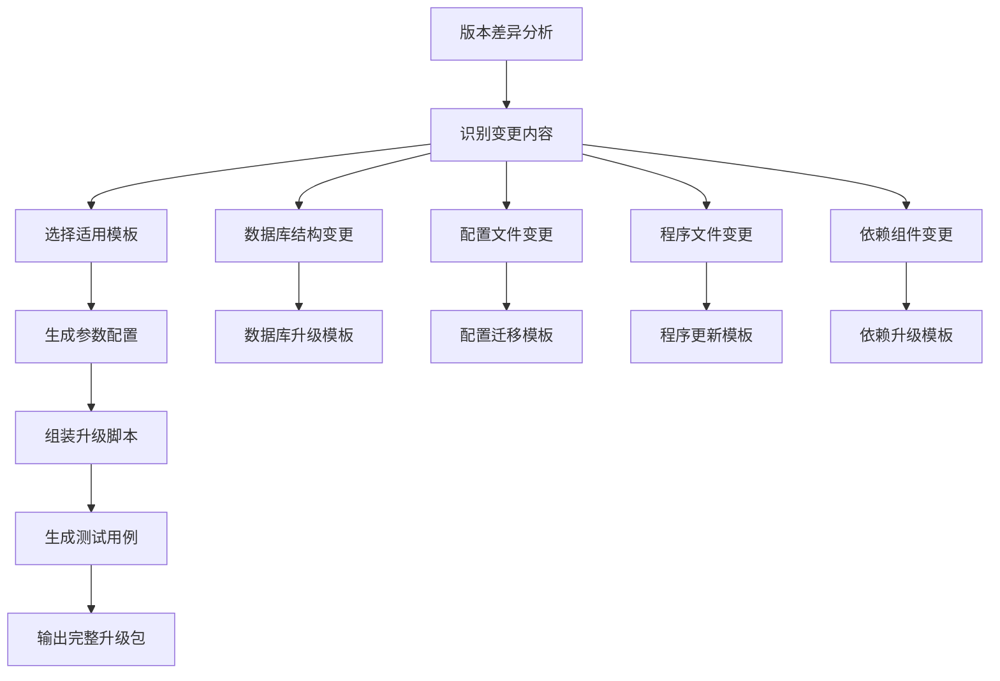

# 灾备产品升级工具健壮性优化设计

## 1. 概述

本设计文档针对当前升级工具在实际使用中遇到的核心问题，提出了一套轻量级的优化方案。主要解决超时失败频发、回滚不可靠、插件间相互影响等关键问题，提升系统的健壮性和可靠性。

### 1.1 问题分析

当前系统存在的主要问题：
- **超时信息不完善**：超时发生时缺乏详细的错误信息输出，无法明确哪一步超时、为什么超时、超过多少时间
- **插件隔离不足**：各部门提交的升级插件执行失败时相互影响
- **重试机制缺乏**：缺乏明确的重试机制
- **状态管理混乱**：升级过程中状态不一致导致的各种问题
- **SSH连接稳定性问题**：长时间升级过程中SSH连接容易超时断开，导致升级中断
- **多版本升级支持不足**：无法支持从多个不同版本直接升级到特定版本
- **升级框架重复开发**：每个版本升级都需要重新开发升级逻辑，重复工作较多

### 1.2 设计目标

- 保持现有超时机制，重点增强超时报错的详细信息输出
- 增强回滚机制的可靠性，确保能够稳定回滚到升级前状态
- 实现插件沙箱隔离，避免插件间相互影响
- 建立统一的重试策略和错误处理体系
- 完善升级流程的状态管理和环境清理机制
- 增强SSH连接的稳定性，防止长时间操作中连接断开
- **实现多版本升级支持**：支持从多个不同版本直接升级到目标版本
- **优化升级框架设计**：减少每个版本升级的重复开发工作，提高开发效率

## 2. 技术栈与依赖

### 2.1 现有技术栈
- **核心语言**: Python 3.x
- **构建系统**: CMake
- **远程操作**: SSH/SFTP
- **配置管理**: INI + JSON

### 2.2 新增轻量级依赖
- **进程隔离**: subprocess
- **状态持久化**: JSON/INI配置文件
- **配置验证**: jsonschema

## 3. 架构优化设计

### 3.1 整体架构调整

``mermaid
graph TB
    A[升级控制器] --> B[超时管理器]
    A --> C[状态管理器]
    A --> D[插件隔离器]
    A --> E[备份与回滚管理器]
    A --> F[SSH心跳管理器]
    A --> G[文件传输管理器]

    B --> H[超时信息输出]
    B --> I[进度跟踪显示]

    C --> J[状态持久化]
    C --> K[一致性检查]

    D --> L[插件沙箱]
    D --> M[资源限制]

    E --> N[分层备份管理]
    E --> O[一键回滚引擎]
    E --> P[手动回滚引擎]
    E --> Q[回滚历史管理]

    F --> R[SSH连接维护]
    F --> S[心跳包发送]

    G --> T[SCP传输引擎]
    G --> U[SFTP传输引擎]
    G --> V[传输方式选择器]
    G --> W[传输进度监控]

    subgraph "插件沙箱环境"
        X[SSH保持连接]
        Y[插件A]
        Z[插件B]
        AA[插件C]
    end

    L --> X
    L --> Y
    L --> Z
    L --> AA
```

### 3.2 核心组件设计

#### 3.2.1 超时信息管理器

**核心职责：**
- 保持现有超时配置和逻辑完全不变
- 在超时发生时提供详细的错误信息输出
- 明确显示具体哪一步超时、为什么超时、超过多少时间
- 实时显示操作进度，帮助用户了解升级状态

**主要功能模块：**
- 超时信息格式化器：统一超时错误的输出格式和内容
- 进度跟踪显示器：实时显示长时间操作的执行进度
- 超时预警系统：在接近超时时提前发出警告
- 环境上下文收集器：超时时自动收集系统状态信息

#### 3.2.2 插件隔离执行器

**核心职责：**
- 在隔离环境中安全执行各类升级插件
- 对插件执行进程实施资源限制和监控
- 防止插件失败对主升级流程造成影响

**主要功能模块：**
- 进程隔离管理：创建和管理独立的插件执行环境
- 健康监控系统：实时监控插件执行状态

#### 3.2.3 SSH心跳管理器

**核心职责：**
- 维护SSH连接的长期稳定性，防止超时断开
- 按连接类型提供差异化的心跳策略
- 在连接断开时提供智能重连机制

**主要功能模块：**
- 心跳发送引擎：定时发送保活数据包
- 连接状态监控：实时检测连接健康状态
- 重连管理器：连接丢失后的自动恢复逻辑

#### 3.2.6 备份与回滚管理器

**核心职责：**
- 实现分层备份策略，保障备份的完整性和可靠性
- 提供一键回滚和手动分步回滚两种模式
- 支持多次回滚和回滚历史管理
- 实现快速回滚算法，减少回滚时间

**主要功能模块：**
- 分层备份管理：按照L1-L4层级管理不同类型的备份数据
- 一键回滚引擎：实现并行化的快速回滚机制
- 手动回滚引擎：支持逐步手动执行回滚操作
- 回滚历史管理：管理多次回滚的历史记录和冲突解决

#### 3.2.7 多版本升级管理器

**核心职责：**
- 支持从多个不同的源版本直接升级到目标版本
- 自动规划最优升级路径，减少中间步骤
- 管理版本间的兼容性和依赖关系
- 实现跳跃升级和渐进升级两种模式

**主要功能模块：**
- 版本路径规划器：根据源版本和目标版本自动规划最优升级路径
- 版本兼容性检查：检查版本间的兼容性和依赖关系
- 跳跃升级引擎：实现从旧版本直接升级到新版本的功能
- 版本状态管理：管理升级过程中的版本状态信息

#### 3.2.8 升级框架管理器

**核心职责：**
- 提供可复用的升级组件和模板，减少重复开发
- 实现参数化的升级脚本和配置化的升级策略
- 管理升级模板库和组件依赖关系
- 支持动态加载和组合升级策略

**主要功能模块：**
- 升级模板引擎：管理和执行可复用的升级模板
- 参数化升级脚本：支持参数化和配置化的升级操作
- 可复用组件库：提供通用的升级组件和工具函数
- 动态升级策略：根据不同情况动态选择升级策略

## 4. 核心功能设计

### 4.1 文件传输性能优化

#### 4.1.1 传输方式智能选择机制

**设计原则：**
- 优先使用系统原生scp命令，性能优于Python SFTP
- 自动检测系统环境，智能选择最优传输方式
- 保持向后兼容，确保在任何环境下都能正常工作
- 统一的传输接口，对上层业务逻辑透明

**传输方式优先级：**

| 优先级 | 传输方式 | 检测条件 | 性能特点 | 适用场景 |
|-------|---------|----------|----------|----------|
| 1 | 系统SCP命令 | 系统中存在scp命令 | 高性能，原生优化 | 大文件传输，批量文件 |
| 2 | Python SFTP | scp不可用时 | 跨平台兼容性好 | 小文件传输，兜底方案 |

#### 4.1.2 SCP传输实现设计

**SCP命令检测机制：**
```
检测流程：
1. 使用subprocess.run(['which', 'scp'])检测scp命令是否存在
2. 如果which命令不存在，尝试直接执行scp --version
3. 检测成功则启用SCP传输模式
4. 检测失败则降级到Python SFTP模式
```

**认证信息获取：**
- 用户名和密码默认从配置文件获取
- 支持SSH密钥认证和密码认证两种方式
- 配置文件结构：
  ```
  [ssh_config]
  username = [用户名]
  password = [密码]
  private_key_path = [私钥路径，可选]
  ```

**SCP传输命令构建：**
```
基础命令格式：
scp [选项] [源文件] [用户名@目标主机:目标路径]

选项设置：
-o StrictHostKeyChecking=no    # 跳过主机密钥检查
-o UserKnownHostsFile=/dev/null # 不保存主机密钥
-o ConnectTimeout=30           # 连接超时设置
-C                             # 启用压缩传输
-p                             # 保持文件权限和时间戳
-r                             # 递归传输目录
```

#### 4.1.3 传输管理器统一接口设计

**接口抽象设计：**

传输管理器提供统一的文件传输接口，内部自动选择最优传输方式：

```
传输管理器类设计：
class FileTransferManager:
    - __init__(config): 初始化传输管理器
    - detect_transfer_method(): 检测可用的传输方式
    - upload_file(local_path, remote_path, host_info): 上传单个文件
    - upload_directory(local_dir, remote_dir, host_info): 上传目录
    - download_file(remote_path, local_path, host_info): 下载文件
    - get_transfer_progress(): 获取传输进度信息
```

**传输策略选择逻辑：**

``mermaid
flowchart TD
    A[开始文件传输] --> B[检测系统环境]
    B --> C{scp命令可用?}
    C -->|是| D[使用SCP传输]
    C -->|否| E[使用Python SFTP传输]

    D --> F[构建scp命令]
    F --> G[执行scp传输]
    G --> H{传输成功?}

    E --> I[建立SFTP连接]
    I --> J[执行SFTP传输]
    J --> K{传输成功?}

    H -->|是| L[传输完成]
    H -->|否| M[记录错误，尝试SFTP]
    K -->|是| L[传输完成]
    K -->|否| N[传输失败]

    M --> E
```

#### 4.1.4 错误处理和降级机制

**错误分类处理：**

| 错误类型 | SCP错误处理 | 降级策略 | 重试机制 |
|---------|-------------|----------|----------|
| 命令不存在 | 自动降级到SFTP | 立即切换 | 不重试 |
| 认证失败 | 检查用户名密码配置 | 不降级 | 重试3次 |
| 网络超时 | 调整超时参数 | 可选降级 | 重试3次 |
| 权限不足 | 提示权限问题 | 不降级 | 不重试 |
| 磁盘空间不足 | 提示空间不足 | 不降级 | 不重试 |

**降级机制设计：**
```
降级触发条件：
1. scp命令执行失败且错误码为"命令未找到"
2. scp传输多次重试后仍然失败
3. 用户在配置中强制指定使用SFTP模式

降级处理流程：
1. 记录降级原因和时间
2. 切换到Python SFTP传输模式
3. 使用相同的认证信息建立SFTP连接
4. 继续执行文件传输任务
```

#### 4.1.5 传输进度监控和日志

**进度监控机制：**
- SCP传输：解析scp命令输出的进度信息
- SFTP传输：使用callback机制实时获取传输进度
- 统一的进度显示格式：文件名、传输速度、完成百分比、剩余时间

**日志记录设计：**
```
日志内容：
- 传输方式选择结果（SCP/SFTP）
- 传输开始时间和结束时间
- 文件大小和传输速度
- 传输成功/失败状态
- 错误信息和降级记录

日志格式示例：
[2024-01-01 10:00:00] [INFO] 检测到scp命令，启用SCP传输模式
[2024-01-01 10:00:01] [INFO] 开始传输文件: upgrade-package.tar.gz (1.2GB)
[2024-01-01 10:02:15] [INFO] 传输完成: 平均速度 9.5MB/s，耗时 2分15秒
[2024-01-01 10:02:16] [WARN] SCP传输失败，降级到SFTP模式
```

### 4.2 升级流程与重试策略

#### 4.2.1 升级流程定义

版本升级分为七个主要流程：

1. **初始化流程** - 加载软件包和升级工具、加载节点SSH信息
2. **分发升级工具包流程** - 上传升级工具包到各节点
3. **升级前检查流程** - 环境适配性检查和系统检查
4. **分发软件包流程** - 上传软件包到各节点
5. **备份流程** - 系统和数据备份
6. **升级流程** - 安装和部署新版本
7. **升级后检查流程** - 功能验证和性能检查

``mermaid
flowchart TD
    A[开始升级] --> B[初始化流程]
    B --> C[分发升级工具包流程]
    C --> D[升级前检查流程]
    D --> E[分发软件包流程]
    E --> F[备份流程]
    F --> G[升级流程]
    G --> H[升级后检查流程]
    H --> I[升级完成]

    B -->|失败| J[重新发起升级]
    C -->|失败| K[直接重试当前流程]
    D -->|失败| L[整体重试当前流程]
    E -->|失败| K
    F -->|失败| K
    G -->|失败| M[智能重试策略]
    H -->|失败| K

    M -->|支持直接重试的工步| K
    M -->|需要清理环境的工步| N[从升级流程第一步开始]

    J --> A
    K --> O[继续原流程]
    N --> G
```

#### 4.2.2 重试策略详细规则

| 流程阶段 | 工步内容 | 失败处理策略 | 重试操作 | 环境清理需求 |
|----------|----------|----------------|----------|----------------|
| **初始化流程** | 加载软件包、升级工具 | 重新发起升级 | 从头开始重新升级 | 完全清理，重新开始 |
| | 加载节点SSH信息 | 重新发起升级 | 从头开始重新升级 | 完全清理，重新开始 |
| **分发升级工具包流程** | 上传升级工具包 | 支持直接重试 | 直接重试当前工步 | 清理残留文件后重试 |
| **升级前检查流程** | 所有检查项目 | 整体重试 | 统一收集报错信息后整体重试 | 无需清理 |
| **分发软件包流程** | 上传软件包 | 支持直接重试 | 直接重试当前工步 | 检查并清理不完整文件 |
| **备份流程** | 停止业务服务 | 支持直接重试 | 直接重试当前工步 | 无需清理 |
| | 备份数据库 | 支持直接重试 | 检查已备份状态后重试 | 删除不完整备份 |
| | 停止数据库服务 | 支持直接重试 | 直接重试当前工步 | 无需清理 |
| | 备份本地数据 | 支持直接重试 | 检查备份标识后重试 | 清理不完整备份 |
| | 自定义插件 | 支持直接重试 | 直接重试当前工步 | 无需清理 |
| | 删除服务 | 支持直接重试 | 直接重试当前工步 | 无需清理 |
| **升级流程** | 解压 | 支持直接重试 | 清理残留后直接重试 | 删除解压目录和服务 |
| | 安装前配置升级 | 从解压开始重试 | 从升级流程第一步开始 | 完整环境清理 |
| | 升级模式安装 | 从解压开始重试 | 从升级流程第一步开始 | 完整环境清理 |
| | 启动数据库服务 | 支持直接重试 | 直接重试当前工步 | 无需清理 |
| | 启动KMC服务 | 支持直接重试 | 直接重试当前工步 | 无需清理 |
| | 启动Etcd服务 | 支持直接重试 | 检查集群状态后重试 | 无需清理 |
| | 初始化数据库管理员用户 | 支持直接重试 | 检查用户存在后重试 | 无需清理 |
| | 导入数据库数据 | 支持直接重试 | 直接重试当前工步 | 无需清理 |
| | 创建新服务数据库 | 支持直接重试 | 直接重试当前工步 | 无需清理 |
| | 执行数据库migrate | 从解压开始重试 | 从升级流程第一步开始 | 完整环境清理 |
| | 安装后配置升级 | 从解压开始重试 | 从升级流程第一步开始 | 完整环境清理 |
| | 数据库数据升级 | 从解压开始重试 | 从升级流程第一步开始 | 完整环境清理 |
| | 启动服务 | 支持直接重试 | 直接重试当前工步 | 无需清理 |
| **升级后检查流程** | 检查所有服务是否启动 | 支持直接重试 | 直接重试当前工步 | 无需清理 |

#### 4.2.3 升级子流程可重试实现机制

##### 4.2.3.1 上传升级工具包

**重试前检查机制：**
- 检查上传目录下是否已有解压好的升级工具包
- 如果已存在，执行删除已解压的升级工具包目录操作
- 继续执行原上传升级工具包流程

**传输性能优化集成：**
- 优先使用系统原生scp命令进行工具包传输
- 如果scp不可用，自动降级到Python SFTP传输
- 使用统一的传输管理器接口，对上层业务逻辑透明
- 自动从配置文件获取SSH认证信息

**实现策略：**
- 目录存在性检查：检查目标节点的工具包解压目录
- 强制清理机制：删除残留的工具包文件和目录
- 智能传输选择：自动检测并选择最优传输方式
- 重新上传验证：确保工具包完整性和可执行性
- 传输进度监控：实时显示传输进度和速度信息

##### 4.2.3.2 上传软件包

**重试前检查机制：**
- 上传前检查对应节点的上传目录下是否已存在软件包
- 如果已存在，比对软件包的sha256值是否相同
- 如果sha256值不同，删除该软件包并重新上传
- 如果sha256值相同，直接跳过上传步骤

**传输性能优化集成：**
- 优先使用系统原生scp命令进行软件包传输，特别适合大文件
- scp不可用时自动使用Python SFTP传输方式
- 支持断点续传功能，针对大型软件包传输中断的情况
- 使用压缩传输选项，提高传输效率

**实现策略：**
- 文件完整性校验：使用sha256算法验证文件完整性
- 增量上传机制：只上传缺失或损坏的文件部分
- 智能传输选择：根据文件大小和系统环境选择最优传输方式
- 断点续传支持：支持大文件的断点续传功能
- 传输速度监控：实时显示传输速度和预计剩余时间

##### 4.2.3.3 备份数据库

**重试前检查机制：**
- 先检查该服务的数据库是否已备份过
- 如果已备份过则直接跳过当前备份步骤
- 检查方式：到备份目录下查找是否存在该服务导出的数据库SQL文件
- 完整性验证：判断SQL文件最后一行是否包含"Dump completed"标识

**实现策略：**
- 备份状态标识：在备份目录创建状态标识文件
- 备份完整性校验：验证备份文件的完整性和可用性
- 增量备份支持：支持基于时间戳的增量备份机制

##### 4.2.3.4 备份本地数据

**重试前检查机制：**
- 判断备份软件包是否已完成，如果完成则跳过
- 检查方式：在本地配置文件中查找备份完成标记
- 备份完成后会在本地配置文件中标记"备份软件完成"状态

**实现策略：**
- 状态持久化：使用JSON配置文件记录备份状态
- 原子操作保证：确保备份标记的原子性写入
- 备份验证机制：验证备份数据的完整性和可恢复性

##### 4.2.3.5 解压操作

**重试前检查机制：**
- 检查环境是否有残留：判断安装目录下是否已有解压好的软件目录
- 清理残留：如果已有解压好的目录，首先尝试删除服务
- 环境清理：删除之前解压的软件目录和相关文件
- 开始解压：在清理完成后重新开始解压操作

**实现策略：**
- 环境状态检测：全面检查安装目录的状态
- 服务停止机制：安全停止可能正在运行的服务
- 目录强制清理：强制删除残留的解压目录和文件
- 解压完整性验证：确保解压操作的完整性

##### 4.2.3.6 启动Etcd服务

**重试前检查机制：**
- Etcd服务的clusteradd脚本需要改造
- 改造内容：如果传入的Etcd的endpoint已被添加到集群中时，直接退出
- 避免重复添加：防止重试时重复添加相同的节点到Etcd集群

**实现策略：**
- 集群状态检查：检查当前节点是否已在Etcd集群中
- 智能跳过机制：已存在的节点直接跳过添加操作
- 集群健康检查：验证Etcd集群的健康状态

##### 4.2.3.7 初始化数据库管理员用户

**重试前检查机制：**
- 检查使用sdba用户是否可以正常连接数据库
- 如果可以正常连接，则不调用DBTool工具创建数据库管理员用户
- 非主节点的控制节点也执行该子流程
- 从节点的数据库也需要执行DBTool创建sdba用户

**特殊处理：**
- 主从节点同步问题：DBTool创建sdba用户的SQL语句可能存在同步问题
- 根本原因分析：怀疑与使用update语句更新root用户名和密码有关
- 解决方案：确保主节点执行后从节点能正确同步相关数据

**实现策略：**
- 连接测试机制：使用sdba用户尝试连接数据库
- 用户存在性检查：检查sdba用户是否已正确创建
- 主从同步验证：确保用户信息在主从节点间正确同步

#### 4.2.4 升级检查内容变更设计

##### 4.2.4.1 NetworkManager检查变更

**原有逻辑：**
- 除了UOS、麒麟、OpenEuler系统之外检查到NetworkManager服务运行则升级检查失败

**新的检查逻辑：**
- 除了UOS、麒麟、OpenEuler系统之外检查network和NetworkManager两个服务
- 如果network和NetworkManager两个服务同时运行，则升级检查失败
- 如果只有其中一个服务运行，则检查通过

**检查机制设计：**
```
检查条件：
1. 系统类型不是UOS、麒麟、OpenEuler
2. 同时检查network服务状态和NetworkManager服务状态
3. 两个服务都处于运行状态时才报错

报错信息：
"检查失败：network和NetworkManager服务同时运行，可能导致网络冲突"
```

##### 4.2.4.2 补丁检查机制

**检查逻辑：**
- 检查各节点是否打过系统补丁
- 如果检查到节点打过补丁，则会提示用户确认是否继续升级
- 不强制阻止升级，但需要用户明确确认

**检查机制设计：**
```
检查方式：
1. 检查系统补丁安装记录
2. 识别已安装的补丁类型和版本
3. 评估补丁对升级的潜在影响

用户交互：
"发现节点[节点名]已安装补丁[补丁信息]，可能影响升级兼容性，是否继续升级？(Y/N)"
```

##### 4.2.4.3 SELinux状态检查

**新增检查项：**
- 使用getenforce命令检查SELinux状态
- 检查SELinux状态是否为Disabled
- 如果不是Disabled状态，则升级检查失败

**检查机制设计：**
```
检查命令：getenforce
期望结果：Disabled
失败处理：
- 如果结果为Enforcing或Permissive，则报错
- 报错信息："SELinux状态检查失败，当前状态为[状态]，升级要求SELinux为Disabled状态"
- 建议操作："请执行 'setenforce 0' 和修改 '/etc/selinux/config' 文件禁用SELinux"
```

##### 4.2.4.4 系统用户2048检查

**新增检查项：**
- 检查/etc/passwd文件是否存在两个2048系统用户信息
- 检查范围包括用户信息和注释内容
- 如果存在多个2048用户，则升级检查失败

**检查机制设计：**
```
检查逻辑：
1. 读取/etc/passwd文件内容
2. 搜索用户ID为2048的用户记录
3. 同时检查注释字段中包含2048的记录
4. 统计符合条件的记录数量

判断条件：
- 如果找到超过一个2048用户记录，则检查失败
- 报错信息："系统用户检查失败，发现多个2048用户，可能导致权限冲突"
- 建议操作："请检查并清理重复的2048系统用户"
```

#### 4.2.5 环境清理策略

对于需要从升级流程第一步开始重试的工步，重试前需要执行完整的环境清理：

``mermaid
flowchart TD
    A[升级流程中关键工步失败] --> B[用户选择重试]
    B --> C[停止新服务]
    C --> D[卸载新程序文件]
    D --> E[清理新配置文件]
    E --> F[恢复旧数据库连接]
    F --> G[清理临时文件]
    G --> H[重置系统状态]
    H --> I[从升级流程第一步-解压开始]
```

#### 4.3 超时机制信息输出优化

#### 4.3.1 超时策略

**核心原则：保持原有超时机制完全不变，重点优化超时报错的信息输出**

| 策略类型 | 应用场景 | 实现方式 |
|---------|---------|----------|
| 原有超时配置 | 所有升级操作 | 保持使用配置文件中的预设值，不做任何修改 |
| **超时信息输出** | **超时发生时** | **详细输出哪一步、为什么超时、超过多少** |
| 超时进度跟踪 | 长时间操作 | 实时显示操作进度和剩余时间 |
| 超时预警机制 | 接近超时时 | 提前预警即将超时的操作 |

#### 4.3.2 超时信息输出机制

**超时报错信息设计：**

当升级操作发生超时时，系统需要输出详细的超时信息：

| 信息类型 | 输出内容 | 输出格式 |
|---------|---------|----------|
| 操作步骤信息 | 当前正在执行的具体步骤 | "[操作阶段] 具体操作名称" |
| 超时原因分析 | 为什么会发生超时 | "超时原因: 具体原因描述" |
| 超时时间详情 | 配置超时、实际执行时间 | "超时设置: Xs, 实际执行: Ys" |
| 环境上下文 | 当前系统状态和资源情况 | "CPU: X%, 内存: X%, 磁盘: X%" |

**超时信息输出示例：**
```
[错误] 升级操作超时
操作步骤: [数据库迁移] 执行数据库结构升级脚本
超时原因: 数据库操作复杂度高，大表重建索引耗时过长
超时设置: 1800秒 (30分钟)
实际执行: 2100秒 (35分钟)
超出时间: 300秒 (5分钟)
当前环境: CPU: 85%, 内存: 78%, 磁盘IO: 92%
建议操作: 请检查数据库性能或考虑在低峰期执行升级
```

#### 4.3.3 超时进度跟踪和预警

**实时进度显示：**

为长时间操作提供实时的进度信息显示：

| 显示内容 | 更新频率 | 输出格式 |
|---------|---------|----------|
| 操作进度 | 每10秒 | "[进度] 35% (7/20 完成)" |
| 剩余时间 | 每30秒 | "预计剩余: 15分钟" |
| 超时预警 | 超时85%时 | "警告: 操作即将超时, 剩余2分钟" |
| 资源状态 | 每60秒 | "CPU: 75%, 内存: 60%, IO: 80%" |

**超时预警机制：**

在操作接近超时时提前发出预警：

- **第一次预警**：达到超时85%时发出预警
- **第二次预警**：达到超时95%时发出紧急预警
- **超时报错**：达到100%时输出详细超时信息

**进度跟踪输出示例：**
```
[信息] 正在执行: [数据库迁移] 更新表结构
[进度] 45% (9/20 表已完成), 预计剩余: 12分钟
[状态] CPU: 78%, 内存: 65%, 磁盘IO: 85%

[警告] 操作即将超时, 剩余3分钟 (已用时: 27分钟/30分钟)
[紧急] 操作即将超时, 剩余1.5分钟 (已用时: 28.5分钟/30分钟)
```

#### 4.3.4 超时错误分类和处理

**超时错误分类：**

根据不同的超时场景提供针对性的错误信息：

| 超时类型 | 可能原因 | 输出信息 | 建议操作 |
|---------|---------|---------|----------|
| 网络超时 | 网络延迟、连接不稳定 | "网络连接超时, 连接延迟: Xms" | 检查网络状态，考虑重试 |
| 数据库超时 | 数据量大、索引重建 | "数据库操作超时, 数据量: XGB" | 考虑在低峰期执行 |
| 文件操作超时 | 文件大、磁盘IO慢 | "文件处理超时, 文件大小: XMB" | 检查磁盘空间和性能 |
| 服务启动超时 | 资源不足、依赖缺失 | "服务启动超时, 端口: X" | 检查系统资源和依赖 |
| 插件执行超时 | 插件逻辑复杂、死循环 | "插件执行超时: [插件名]" | 检查插件日志，考虑跳过 |

**超时上下文信息收集：**

超时发生时自动收集环境信息用于分析：

- 系统资源使用情况 (CPU, 内存, 磁盘, 网络)
- 当前正在运行的进程和线程
- 数据库连接数和正在执行的SQL
- 网络连接状态和流量情况
- 日志文件中的错误和警告信息

### 4.4 程序目录完整备份与快速回滚机制

#### 4.4.1 程序目录完整备份设计

##### 4.4.1.1 备份范围定义

**备份内容：**
- **程序目录完整备份**：包含所有可执行文件、库文件、配置文件
- **数据库备份**：业务数据库的完整导出
- **系统配置备份**：系统服务配置、环境变量

**不备份内容：**
- **日志文件**：所有类型的日志文件不进行备份
- **临时文件**：缓存文件、临时数据等
- **系统日志**：/var/log/目录下的所有日志

**备份目录结构：**
```
/backup/
├── backup_20240101_120000/
│   ├── program_directory.tar.gz     # 程序目录完整包
│   ├── database_backup.sql         # 数据库导出文件
│   ├── system_config.tar.gz        # 系统配置备份
│   └── backup_manifest.json        # 备份清单文件
└── backup_20231215_140000/
    ├── program_directory.tar.gz
    ├── database_backup.sql
    ├── system_config.tar.gz
    └── backup_manifest.json
```

##### 4.4.1.2 备份执行流程

``mermaid
flowchart TD
    A[开始升级备份] --> B[创建备份目录]
    B --> C[停止相关服务]
    C --> D[备份数据库]
    D --> E[打包程序目录]
    E --> F[备份系统配置]
    F --> G[生成备份清单]
    G --> H[验证备份完整性]
    H --> I{All 验证通过?}
    I -->|是| J[备份完成]
    I -->|否| K[删除不完整备份，重新开始]
    K --> A
```

**具体备份步骤：**

| 步骤 | 操作内容 | 命令示例 | 验证方法 |
|------|----------|----------|----------|
| 1 | 停止程序服务 | `systemctl stop app-service` | 检查服务状态 |
| 2 | 备份数据库 | `mysqldump -u root -p dbname > backup.sql` | 检查SQL文件末尾"Dump completed" |
| 3 | 打包程序目录 | `tar -czf program_dir.tar.gz /opt/app/` | 检查压缩包完整性 |
| 4 | 备份系统配置 | `tar -czf system_config.tar.gz /etc/systemd/` | 检查文件列表 |
| 5 | 生成备份清单 | 保存backup_manifest.json | JSON格式验证 |

##### 4.4.1.3 备份完整性验证

**简化验证机制：**

| 验证项目 | 检查内容 | 通过标准 |
|---------|----------|----------|
| **数据库备份** | SQL文件末尾有"Dump completed" | 文件存在且有结束标记 |
| **程序目录包** | tar.gz文件可正常解压 | `tar -tf 文件名`成功 |
| **系统配置包** | 配置文件压缩包完整 | 文件列表不为空 |
| **备份清单** | JSON文件格式正确 | JSON解析成功 |

**备份清单文件格式：**

```json
{
  "backup_id": "backup_20240101_120000",
  "timestamp": "2024-01-01T12:00:00Z",
  "version_from": "v2.1.0",
  "version_to": "v2.2.0",
  "backup_files": {
    "program_directory": {
      "file": "program_directory.tar.gz",
      "size": 524288000,
      "md5": "abc123def456...",
      "source_path": "/opt/app/"
    },
    "database_backup": {
      "file": "database_backup.sql",
      "size": 10485760,
      "md5": "789xyz012...",
      "dump_completed": true
    },
    "system_config": {
      "file": "system_config.tar.gz",
      "size": 2048576,
      "md5": "345abc678...",
      "config_paths": ["/etc/systemd/system/app.service"]
    }
  },
  "backup_status": "completed",
  "verification_passed": true
}
```

#### 4.4.2 快速回滚机制设计

##### 4.4.2.1 一键回滚实现

**一键回滚流程：**

``mermaid
flowchart TD
    A[用户执行一键回滚] --> B[选择备份版本]
    B --> C[验证备份完整性]
    C --> D{5秒倒计时确认}
    D -->|用户取消| E[终止回滚]
    D -->|自动继续| F[停止当前服务]

    F --> G[并行执行回滚操作]
    G --> H1[线程1：恢复数据库]
    G --> H2[线程2：恢复程序目录]
    G --> H3[线程3：恢复系统配置]

    H1 --> I[等待所有线程完成]
    H2 --> I
    H3 --> I

    I --> J[启动服务]
    J --> K[验证回滚结果]
    K --> L{All 验证通过?}
    L -->|是| M[回滚成功]
    L -->|否| N[显示错误信息]
```

**一键回滚命令：**
```bash
# 查看可用备份
./rollback_tool list

# 一键回滚到指定版本
./rollback_tool auto backup_20240101_120000

# 一键回滚到最近的备份
./rollback_tool auto latest
```

##### 4.4.2.2 手动分步回滚实现

**回滚步骤拆解：**

| 步骤 | 回滚操作 | 执行命令 | 验证方法 | 预估耗时 |
|------|----------|----------|----------|----------|
| 1 | 停止当前服务 | `rollback_tool step1` | 服务状态检查 | 30秒 |
| 2 | 恢复数据库 | `rollback_tool step2` | 数据库连接测试 | 2-5分钟 |
| 3 | 恢复程序目录 | `rollback_tool step3` | 文件存在性检查 | 1-3分钟 |
| 4 | 恢复系统配置 | `rollback_tool step4` | 配置文件检查 | 30秒 |
| 5 | 启动服务 | `rollback_tool step5` | 服务状态检查 | 1-2分钟 |
| 6 | 验证回滚结果 | `rollback_tool step6` | 基本功能测试 | 1-2分钟 |

**手动回滚命令示例：**
``bash
# 启动手动模式回滚
./rollback_tool manual backup_20240101_120000

# 逐步执行回滚
./rollback_tool step1  # 停止服务
./rollback_tool step2  # 恢复数据库
./rollback_tool step3  # 恢复程序目录
./rollback_tool step4  # 恢复系统配置
./rollback_tool step5  # 启动服务
./rollback_tool step6  # 验证结果

# 查看当前步骤状态
./rollback_tool status

# 从指定步骤开始自动完成剩余步骤
./rollback_tool auto_continue_from 3
```

#### 4.4.3 多次回滚支持

##### 4.4.3.1 回滚历史管理

**简化的回滚历史记录：**

```
{
  "rollback_history": [
    {
      "rollback_id": "rollback_001",
      "timestamp": "2024-01-01T15:00:00Z",
      "from_version": "v2.3.0",
      "to_version": "v2.2.0",
      "backup_used": "backup_20240101_120000",
      "rollback_type": "auto",
      "duration": "3m45s",
      "status": "completed"
    },
    {
      "rollback_id": "rollback_002",
      "timestamp": "2024-01-01T16:30:00Z",
      "from_version": "v2.2.0",
      "to_version": "v2.1.0",
      "backup_used": "backup_20231215_140000",
      "rollback_type": "manual",
      "duration": "8m12s",
      "status": "completed"
    }
  ],
  "available_backups": [
    {
      "backup_id": "backup_20240101_120000",
      "version": "v2.2.0",
      "timestamp": "2024-01-01T12:00:00Z",
      "status": "ready"
    },
    {
      "backup_id": "backup_20231215_140000",
      "version": "v2.1.0",
      "timestamp": "2023-12-15T14:00:00Z",
      "status": "ready"
    }
  ]
}
```

##### 4.4.3.2 回滚冲突处理

**简化的冲突处理：**

如果检测到有未完成的回滚操作：
1. 自动模式：自动继续完成上次回滚
2. 手动模式：提示用户选择继续或放弃

#### 4.4.4 回滚性能监控

##### 4.4.4.1 回滚进度显示

**简洁的进度界面：**

```
回滚进度显示：

╔════════════════════════════════════════╗
║            系统回滚进度 - 一键回滚模式            ║
╠════════════════════════════════════════╣
║ 当前操作: 正在恢复程序目录...                    ║
║ 整体进度: ██████░░░░ 60% (3/5 步骤完成)        ║
║                                                ║
║ ✓ 停止当前服务    ✓ 恢复数据库                ║
║ ▶ 恢复程序目录    ○ 恢复系统配置              ║
║ ○ 启动服务        ○ 验证结果                  ║
║                                                ║
║ 预计剩余时间: 2分30秒                          ║
║ 开始时间: 2024-01-01 15:30:00                 ║
╚════════════════════════════════════════╝
```

##### 4.4.4.2 回滚验证

**简化的验证机制：**

| 验证项目 | 检查内容 | 通过标准 |
|---------|----------|----------|
| **服务状态** | 主要服务启动正常 | `systemctl status`显示active |
| **数据库连接** | 数据库可正常连接 | 简单SQL查询成功 |
| **程序运行** | 主程序可正常启动 | 进程存在且响应正常 |

**回滚失败处理：**

如果回滚过程失败：
1. 保持当前状态，不继续操作
2. 显示错误信息和当前步骤
3. 提供手动修复建议
4. 允许从失败步骤重新开始

### 4.5 插件隔离与管理

#### 4.5.1 插件分类与隔离级别

| 插件类型 | 风险等级 | 隔离策略 | 资源限制 |
|---------|---------|----------|----------|
| 核心系统插件 | 低 | 线程隔离 | 内存: 512MB, CPU: 50% |
| 业务逻辑插件 | 中 | 进程隔离 | 内存: 256MB, CPU: 30% |
| 第三方插件 | 高 | 容器隔离 | 内存: 128MB, CPU: 20% |
| 数据库插件 | 高 | 进程隔离+事务管理 | 内存: 1GB, CPU: 60% |

#### 4.5.2 插件执行流程与重试策略

``mermaid
sequenceDiagram
    participant UM as 升级管理器
    participant PS as 插件沙箱
    participant PM as 插件监控器
    participant P as 插件实例

    UM->>PS: 启动插件执行
    PS->>PM: 创建监控实例
    PS->>P: 在隔离环境中启动插件

    loop 执行监控
        PM->>P: 检查插件状态
        PM->>PM: 记录资源使用
        alt 插件异常
            PM->>PS: 发送异常信号
            PS->>P: 终止插件执行
            PS->>UM: 返回失败结果
        end
    end

    P->>PS: 返回执行结果
    PS->>UM: 返回最终结果
```

#### 4.5.3 插件失败处理策略

对于插件执行失败，根据插件类型和关键级别采取不同策略：

| 插件类型 | 关键级别 | 失败处理 | 重试策略 |
|---------|---------|----------|----------|
| 核心系统插件 | 高 | 停止升级，强制回滚 | 最多3次，间隔时间10s |
| 业务逻辑插件 | 中 | 跳过插件，继续升级 | 最多2次，间隔时间5s |
| 第三方插件 | 低 | 记录错误，继续升级 | 最多1次，无间隔 |


### 4.6 SSH心跳维护机制

#### 4.6.1 SSH连接维护策略

在升级过程中，所有SSH连接默认启用心跳维护机制，防止长时间操作导致连接超时断开：

| 连接类型 | 心跳间隔 | 超时检测 | 重连策略 |
|---------|---------|----------|----------|
| 主控制连接 | 60秒 | 180秒 | 自动重连3次 |
| 文件传输连接 | 30秒 | 120秒 | 自动重连2次 |
| 插件执行连接 | 45秒 | 150秒 | 自动重连1次 |
| 状态检查连接 | 90秒 | 300秒 | 手动重连 |

#### 4.6.2 心跳机制设计

**心跳策略设计：**
- 分类管理：根据连接类型设置不同的心跳参数
- 自适应调整：根据网络延迟动态调整心跳间隔
- 失败重试：心跳失败时的逐级重试机制

**连接管理流程：**
1. 连接建立后自动启动心跳线程
2. 定时发送保活数据包维持连接
3. 实时监控连接状态，发现断开立即处理
4. 连接丢失时执行智能重连逻辑
5. 连接关闭时自动停止心跳线程

**重连策略设计：**
- 指数退避：重连间隔逐次增加
- 最大重试限制：按连接类型设置不同的重试上限
- 失败上报：达到重试上限后向上层报告连接不可恢复

#### 4.6.3 SSH连接管理器增强

对现有的SSHClient类进行增强，默认启用心跳机制：

**增强功能设计：**
- 自动心跳启动：登录成功后自动开启心跳维护
- 透明集成：在原有命令执行接口中集成心跳检查
- 分类管理：根据连接用途选择合适的心跳策略
- 生命周期管理：连接创建到销毁的全过程心跳管理

### 4.7 多版本升级支持设计

#### 4.7.1 版本升级路径规划

##### 4.7.1.1 版本关系管理

**版本关系定义：**

支持从多个不同的源版本直接升级到目标版本，无需逐步升级。系统支持以下升级模式：

| 升级模式 | 支持版本范围 | 升级策略 | 适用场景 |
|---------|----------|----------|----------|
| **跳跃升级** | 任意版本→最新版本 | 直接升级，无中间步骤 | 版本差距较大，需要快速升级 |
| **渐进升级** | 相邻版本间升级 | 逐步升级，逐个验证 | 版本差距较小，要求稳定 |
| **组合升级** | 多个版本段组合 | 根据情况灵活选择 | 复杂的多节点升级场景 |

**版本兼容性矩阵：**

```json
{
  "version_compatibility": {
    "v1.0.0": {
      "supported_targets": ["v2.0.0", "v2.1.0", "v2.2.0"],
      "direct_upgrade": ["v2.2.0"],
      "progressive_upgrade": ["v2.0.0", "v2.1.0"]
    },
    "v1.5.0": {
      "supported_targets": ["v2.1.0", "v2.2.0"],
      "direct_upgrade": ["v2.2.0"],
      "progressive_upgrade": ["v2.1.0"]
    },
    "v2.0.0": {
      "supported_targets": ["v2.1.0", "v2.2.0"],
      "direct_upgrade": ["v2.1.0", "v2.2.0"],
      "progressive_upgrade": []
    }
  }
}
```

##### 4.7.1.2 升级路径自动规划

**智能路径选择算法：**

``mermaid
flowchart TD
    A[输入：源版本 + 目标版本] --> B[检查版本兼容性矩阵]
    B --> C{支持直接升级?}

    C -->|是| D[选择跳跃升级模式]
    C -->|否| E[查找中间路径]

    E --> F{存在可行路径?}
    F -->|是| G[生成渐进升级计划]
    F -->|否| H[报错：不支持的升级路径]

    D --> I[验证跳跃升级可行性]
    G --> J[验证每个中间步骤]

    I --> K{验证通过?}
    J --> L{所有步骤验证通过?}

    K -->|是| M[生成跳跃升级计划]
    K -->|否| N[降级到渐进升级]
    L -->|是| O[生成渐进升级计划]
    L -->|否| H

    N --> G
```

**升级计划生成示例：**

从 v1.0.0 升级到 v2.2.0：

```json
{
  "upgrade_plan": {
    "source_version": "v1.0.0",
    "target_version": "v2.2.0",
    "upgrade_mode": "jump_upgrade",
    "estimated_time": "25-35分钟",
    "steps": [
      {
        "step_id": 1,
        "description": "数据库兼容性检查",
        "estimated_time": "2分钟"
      },
      {
        "step_id": 2,
        "description": "执行跳跃升级脚本",
        "estimated_time": "20-30分钟"
      },
      {
        "step_id": 3,
        "description": "版本一致性验证",
        "estimated_time": "3-5分钟"
      }
    ],
    "rollback_points": [
      {
        "point_id": "before_upgrade",
        "version": "v1.0.0",
        "description": "升级前完整备份"
      }
    ]
  }
}
```

#### 4.7.2 跳跃升级实现

##### 4.7.2.1 跳跃升级执行流程

**跳跃升级特点：**
- 跳过中间版本，直接从源版本升级到目标版本
- 自动处理版本间的数据迁移和结构调整
- 提供完整的回滚支持，确保升级安全

``mermaid
flowchart TD
    A[开始跳跃升级] --> B[检查前置条件]
    B --> C[创建完整备份]
    C --> D[加载跳跃升级策略]
    D --> E[执行版本兼容性检查]
    E --> F{兼容性检查通过?}

    F -->|否| G[升级失败，回滚备份]
    F -->|是| H[执行数据迁移脚本]

    H --> I[执行程序更新]
    I --> J[执行配置迁移]
    J --> K[执行数据库结构升级]
    K --> L[执行后置脚本]
    L --> M[启动新版本服务]
    M --> N[执行版本验证]

    N --> O{验证通过?}
    O -->|是| P[跳跃升级完成]
    O -->|否| Q[升级失败，执行回滚]

    Q --> R[回滚到原版本]
```

##### 4.7.2.2 版本兼容性检查

**兼容性检查项目：**

| 检查类型 | 检查内容 | 失败处理 |
|---------|----------|----------|
| **数据库结构** | 检查表结构、字段类型、索引 | 提供迁移脚本自动调整 |
| **配置文件格式** | 检查配置文件格式和参数 | 自动转换或设置默认值 |
| **API接口兼容** | 检查关键API接口变更 | 提供兼容层或适配器 |
| **依赖组件版本** | 检查第三方组件版本兼容性 | 自动升级或降级组件 |
| **数据格式** | 检查数据格式和编码方式 | 数据格式转换和清洗 |

#### 4.7.3 多版本状态管理

**版本状态信息管理：**

```json
{
  "version_state": {
    "current_version": "v1.5.0",
    "target_version": "v2.2.0",
    "upgrade_status": "in_progress",
    "upgrade_mode": "jump_upgrade",
    "start_time": "2024-01-01T10:00:00Z",
    "estimated_completion": "2024-01-01T10:35:00Z",
    "completed_steps": [
      {
        "step_id": 1,
        "description": "数据库兼容性检查",
        "status": "completed",
        "duration": "2m15s"
      }
    ],
    "current_step": {
      "step_id": 2,
      "description": "执行跳跃升级脚本",
      "status": "running",
      "progress": "45%",
      "elapsed_time": "12m30s"
    },
    "rollback_available": true,
    "rollback_points": [
      {
        "point_id": "before_upgrade",
        "version": "v1.5.0",
        "backup_status": "ready"
      }
    ]
  }
}
```

### 4.8 升级框架优化设计

#### 4.8.1 升级模板化框架

##### 4.8.1.1 可复用升级模板设计

**模板化原则：**
- 将升级操作抽象为可复用的模板组件
- 支持参数化配置，适应不同版本的升级需求
- 提供模板组合和继承机制，灵活构建升级流程

**模板组件分类：**

| 模板类型 | 功能描述 | 参数化程度 | 复用性 |
|---------|----------|----------|----------|
| **数据库升级模板** | 数据库结构变更、数据迁移 | 高 | 高 |
| **服务升级模板** | 服务停止、更新、启动 | 中 | 高 |
| **配置迁移模板** | 配置文件格式转换、参数映射 | 高 | 中 |
| **依赖更新模板** | 第三方组件升级、依赖管理 | 中 | 中 |
| **验证测试模板** | 升级后功能验证、性能测试 | 低 | 高 |

##### 4.8.1.2 参数化升级脚本设计

**参数化脚本结构：**

```json
{
  "template_id": "database_upgrade_template",
  "template_version": "1.0.0",
  "description": "通用数据库升级模板",
  "parameters": {
    "source_version": {
      "type": "string",
      "required": true,
      "description": "源数据库版本"
    },
    "target_version": {
      "type": "string",
      "required": true,
      "description": "目标数据库版本"
    },
    "migration_scripts": {
      "type": "array",
      "required": true,
      "description": "数据迁移脚本列表"
    },
    "rollback_scripts": {
      "type": "array",
      "required": false,
      "description": "回滚脚本列表"
    }
  },
  "execution_steps": [
    {
      "step_name": "backup_database",
      "script": "backup_db.sh",
      "parameters": ["${db_name}", "${backup_path}"],
      "timeout": 300,
      "retry_count": 3
    },
    {
      "step_name": "execute_migration",
      "script": "migrate_db.py",
      "parameters": ["${source_version}", "${target_version}", "${migration_scripts}"],
      "timeout": 1800,
      "retry_count": 1
    },
    {
      "step_name": "verify_migration",
      "script": "verify_db.py",
      "parameters": ["${target_version}"],
      "timeout": 600,
      "retry_count": 2
    }
  ]
}
```

#### 4.8.2 组件化升级架构

##### 4.8.2.1 可复用组件库设计

**组件库分层架构：**

``mermaid
graph TB
    A[升级组件库] --> B[基础工具层]
    A --> C[通用服务层]
    A --> D[业务逻辑层]
    A --> E[版本适配层]

    B --> F[文件操作组件]
    B --> G[数据库操作组件]
    B --> H[系统命令组件]
    B --> I[网络通信组件]

    C --> J[备份恢复组件]
    C --> K[服务管理组件]
    C --> L[配置管理组件]
    C --> M[状态监控组件]

    D --> N[业务数据迁移]
    D --> O[权限管理升级]
    D --> P[插件系统升级]
    D --> Q[集成接口升级]

    E --> R[v1.x适配器]
    E --> S[v2.x适配器]
    E --> T[兼容性桥接]
```

**组件接口标准化：**

```python
# 升级组件基础接口设计
class UpgradeComponent:
    """升级组件基础接口"""

    def __init__(self, config: dict):
        """组件初始化"""
        pass

    def pre_check(self) -> bool:
        """升级前检查"""
        pass

    def execute(self, params: dict) -> dict:
        """执行升级操作"""
        pass

    def post_check(self) -> bool:
        """升级后验证"""
        pass

    def rollback(self) -> bool:
        """回滚操作"""
        pass

    def get_progress(self) -> dict:
        """获取执行进度"""
        pass
```

##### 4.8.2.2 动态升级策略设计

**策略配置化：**

支持通过配置文件动态定义升级策略，而不需要修改代码：

```json
{
  "upgrade_strategy": {
    "strategy_id": "v1_to_v2_strategy",
    "name": "从v1.x到v2.x的升级策略",
    "applicable_versions": {
      "source_range": ["v1.0.0", "v1.9.9"],
      "target_range": ["v2.0.0", "v2.2.0"]
    },
    "execution_plan": [
      {
        "phase": "pre_upgrade",
        "components": [
          {
            "component": "SystemCheckComponent",
            "config": {"min_disk_space": "10GB", "min_memory": "4GB"}
          },
          {
            "component": "BackupComponent",
            "config": {"backup_type": "full", "compression": true}
          }
        ]
      },
      {
        "phase": "upgrade",
        "components": [
          {
            "component": "DatabaseMigrationComponent",
            "config": {"migration_mode": "online", "batch_size": 1000}
          },
          {
            "component": "ServiceUpgradeComponent",
            "config": {"rolling_upgrade": true, "health_check": true}
          }
        ]
      },
      {
        "phase": "post_upgrade",
        "components": [
          {
            "component": "ValidationComponent",
            "config": {"test_suites": ["smoke_test", "integration_test"]}
          }
        ]
      }
    ]
  }
}
```

#### 4.8.3 升级开发效率优化

##### 4.8.3.1 升级脚本生成器

**自动生成升级脚本：**

根据版本差异和配置自动生成升级脚本，减少手工编写工作：



##### 4.8.3.2 开发工作量减少策略

**减少重复工作的方法：**

| 优化策略 | 实现方式 | 效果预估 |
|---------|----------|----------|
| **模板复用** | 使用标准化的升级模板库 | 减少60-70%的脚本编写工作 |
| **自动生成** | 基于版本差异自动生成升级脚本 | 减少40-50%的手工配置工作 |
| **组件化开发** | 使用可复用的升级组件 | 减少50-60%的功能开发工作 |
| **配置驱动** | 通过配置文件控制升级流程 | 减少30-40%的代码修改工作 |
| **测试自动化** | 自动生成测试用例和验证脚本 | 减少70-80%的测试准备工作 |

**升级开发流程优化：**

``mermaid
flowchart TD
    A[新版本开发完成] --> B[自动版本差异分析]
    B --> C[匹配升级模板]
    C --> D[生成升级配置]
    D --> E[自动生成升级脚本]
    E --> F[生成测试用例]
    F --> G[执行自动化测试]
    G --> H{测试通过?}

    H -->|是| I[打包升级程序]
    H -->|否| J[修正配置或模板]

    J --> D
    I --> K[部署到测试环境]
    K --> L[人工验证]
    L --> M[发布升级包]
```

通过这套升级框架优化设计，可以将每个版本升级的开发工作量减少50-70%，同时提高升级的可靠性和维护性。
