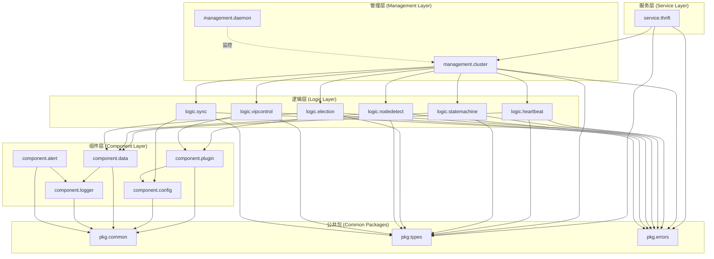
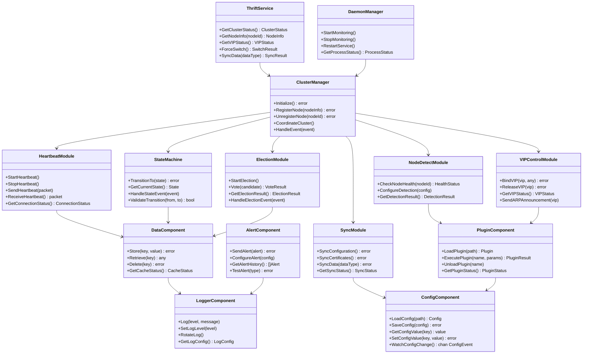
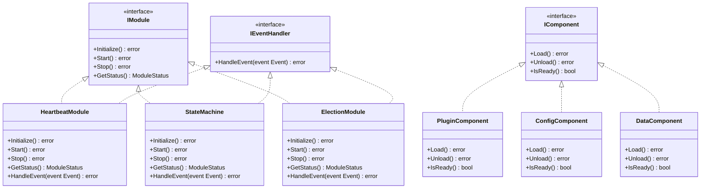
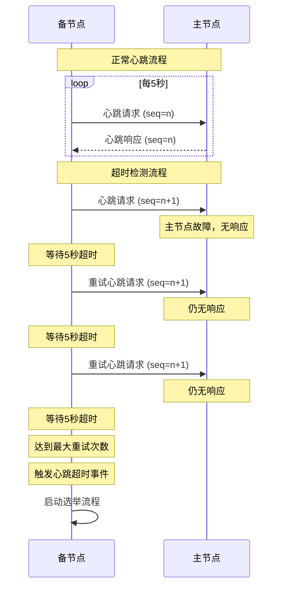
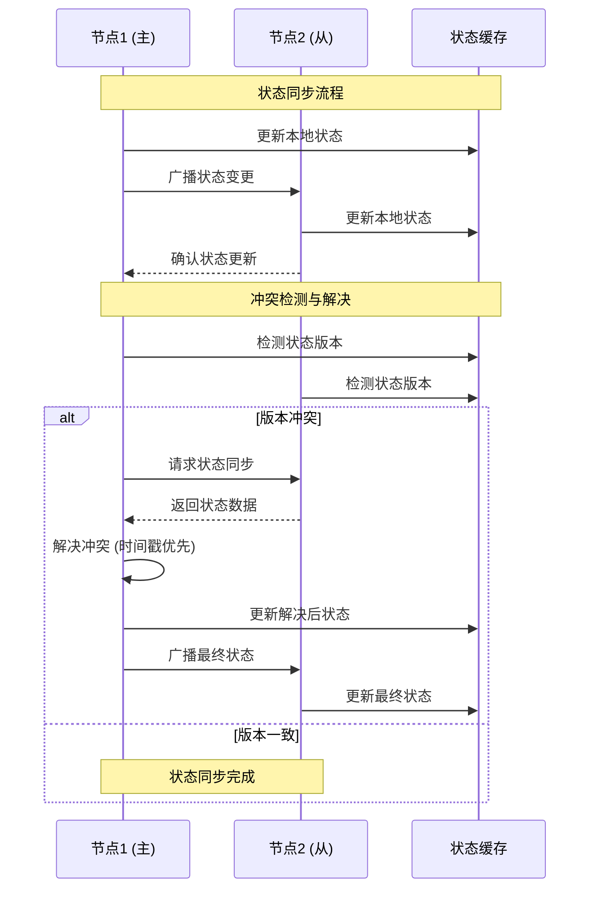

# 集群管理软件接口实现文档

## 1. 集群架构限制

**双节点架构设计**：
* 集群严格限制为双节点模式，最多只允许有两个节点
* 集群由一个主节点（PRIMARY）和一个备节点（STANDBY）组成
* 所有接口设计和数据结构都基于双节点场景
* 不支持多节点集群扩展，确保接口简洁性和调用可靠性

## 2. 模块定义

### 2.1 模块包名称及层级关系

#### 2.1.1 包结构定义

```
HAMgm/
├── cmd/                           # 可执行程序入口包
│   ├── daemon/                    # 守护进程入口 (main.daemon)
│   ├── service/                   # 集群管理进程入口 (main.service)
│   └── cli/                       # 命令行工具入口 (main.cli)
├── internal/                      # 内部包
│   ├── service/                   # 服务层包
│   │   └── thrift/                # Thrift服务实现 (service.thrift)
│   ├── management/                # 管理层包
│   │   ├── daemon/                # 守护管理 (management.daemon)
│   │   └── cluster/               # 集群管理 (management.cluster)
│   ├── logic/                     # 逻辑层包
│   │   ├── heartbeat/             # 心跳检测模块 (logic.heartbeat)
│   │   ├── statemachine/          # 状态机模块 (logic.statemachine)
│   │   ├── election/              # 选举模块 (logic.election)
│   │   ├── nodedetect/            # 节点检测模块 (logic.nodedetect)
│   │   ├── vipcontrol/            # VIP控制模块 (logic.vipcontrol)
│   │   └── sync/                  # 同步模块 (logic.sync)
│   └── component/                 # 组件层包
│       ├── plugin/                # 插件组件 (component.plugin)
│       ├── config/                # 配置组件 (component.config)
│       ├── data/                  # 数据组件 (component.data)
│       ├── logger/                # 日志组件 (component.logger)
│       └── alert/                 # 告警组件 (component.alert)
├── pkg/                           # 公共包
│   ├── common/                    # 公共工具 (pkg.common)
│   ├── types/                     # 类型定义 (pkg.types)
│   └── errors/                    # 错误定义 (pkg.errors)
```

#### 2.1.2 层级依赖关系



### 2.2 各模块功能职责

#### 2.2.1 服务层模块

| 模块名称 | 包名 | 功能职责 |
|---------|------|----------|
| Thrift服务 | service.thrift | 对外提供RPC接口，处理客户端请求，参数校验，响应格式化 |

#### 2.2.2 管理层模块

| 模块名称 | 包名 | 功能职责 |
|---------|------|----------|
| 守护管理 | management.daemon | 进程生命周期管理，故障检测与恢复，资源监控 |
| 集群管理 | management.cluster | 集群初始化，节点注册管理，状态协调，事件分发 |

#### 2.2.3 逻辑层模块

| 模块名称 | 包名 | 功能职责 |
|---------|------|----------|
| 心跳检测模块 | logic.heartbeat | TCP心跳包收发，连接状态维护，网络延迟监控 |
| 状态机模块 | logic.statemachine | 节点状态管理，状态转换控制，状态事件处理 |
| 选举模块 | logic.election | 选举算法执行，投票处理，选举结果管理 |
| 节点检测模块 | logic.nodedetect | 节点健康检查，故障检测，检测策略配置 |
| VIP控制模块 | logic.vipcontrol | VIP绑定释放，网络接口管理，ARP广播 |
| 同步模块 | logic.sync | 数据同步，配置同步，证书同步 |

#### 2.2.4 组件层模块

| 模块名称 | 包名 | 功能职责 |
|---------|------|----------|
| 插件组件 | component.plugin | 插件脚本管理，执行环境提供，结果处理 |
| 配置组件 | component.config | 配置文件解析，参数存储，配置变更通知 |
| 数据组件 | component.data | 内存状态存储，数据持久化，状态同步 |
| 日志组件 | component.logger | 日志输出，日志轮转，日志级别管理 |
| 告警组件 | component.alert | 告警规则处理，邮件WebHook发送，告警级别管理 |

### 2.3 UML类图

#### 2.3.1 整体架构类图



#### 1.3.2 接口继承关系图



## 2. 协议定义

### 2.1 Thrift协议定义

#### 2.1.1 服务接口定义

```thrift
// HAMgm集群管理服务接口定义
namespace go hamgm.thrift

// 集群管理服务接口
service ClusterManagementService {
    // 集群状态查询
    ClusterStatusResponse GetClusterStatus(),
    
    // 节点信息查询
    NodeInfoResponse GetNodeInfo(1: string nodeId),
    
    // 获取所有节点信息
    NodesInfoResponse GetAllNodes(),
    
    // VIP状态查询
    VIPStatusResponse GetVIPStatus(),
    
    // 强制主备切换
    SwitchResponse ForceSwitch(),
    
    // 数据同步
    SyncResponse SyncData(1: SyncRequest request),
    
    // 配置管理
    ConfigResponse GetConfig(1: string configKey),
    ConfigResponse SetConfig(1: string configKey, 2: string configValue),
    
    // 自动切换配置
    AutoSwitchResponse GetAutoSwitchStatus(),
    AutoSwitchResponse SetAutoSwitch(1: bool enabled),
    
    // 节点健康检查
    HealthResponse CheckNodeHealth(1: string nodeId),
    
    // 添加/移除节点
    NodeOperationResponse AddNode(1: NodeInfo nodeInfo),
    NodeOperationResponse RemoveNode(1: string nodeId)
}
```

#### 2.1.2 数据结构定义

```thrift
// 基础数据类型
enum NodeState {
    UNKNOWN = 0,
    CANDIDATE = 1,
    PRIMARY = 2,
    STANDBY = 3,
    MAINTENANCE = 4,
    FAILED = 5
}

enum VIPState {
    UNBOUND = 0,
    BOUND = 1,
    BINDING = 2,
    RELEASING = 3,
    ERROR = 4
}

enum SyncDataType {
    CONFIG = 0,
    CERTIFICATE = 1,
    DATA = 2,
    ALL = 3
}

// 节点信息结构
struct NodeInfo {
    1: required string nodeId,
    2: required string ipAddress,
    3: required i32 port,
    4: required NodeState state,
    5: optional i64 lastHeartbeat,
    6: optional double cpuUsage,
    7: optional double memoryUsage,
    8: optional bool isHealthy,
    9: optional string version
}

// VIP信息结构
struct VIPInfo {
    1: required string vipAddress,
    2: required VIPState state,
    3: optional string boundNodeId,
    4: optional string networkInterface,
    5: optional i64 lastUpdateTime
}

// 集群状态结构
struct ClusterStatus {
    1: required string clusterId,
    2: required list<NodeInfo> nodes,
    3: required VIPInfo vipInfo,
    4: required string primaryNodeId,
    5: required i64 timestamp,
    6: optional bool autoSwitchEnabled,
    7: optional i32 totalNodes,
    8: optional i32 healthyNodes
}

// 心跳信息结构
struct HeartbeatInfo {
    1: required string sourceNodeId,
    2: required string targetNodeId,
    3: required i64 sequenceNumber,
    4: required i64 timestamp,
    5: required i32 crc32Checksum,
    6: optional double latency
}

// 同步请求结构
struct SyncRequest {
    1: required SyncDataType dataType,
    2: optional string targetNodeId,
    3: optional bool forceSync,
    4: optional list<string> specificFiles
}

// 响应结构
struct BaseResponse {
    1: required bool success,
    2: optional string message,
    3: optional i32 errorCode,
    4: required i64 timestamp
}

struct ClusterStatusResponse {
    1: required BaseResponse base,
    2: optional ClusterStatus clusterStatus
}

struct NodeInfoResponse {
    1: required BaseResponse base,
    2: optional NodeInfo nodeInfo
}

struct NodesInfoResponse {
    1: required BaseResponse base,
    2: optional list<NodeInfo> nodes
}

struct VIPStatusResponse {
    1: required BaseResponse base,
    2: optional VIPInfo vipInfo
}

struct SwitchResponse {
    1: required BaseResponse base,
    2: optional string newPrimaryNodeId,
    3: optional string oldPrimaryNodeId
}

struct SyncResponse {
    1: required BaseResponse base,
    2: optional i32 syncedFiles,
    3: optional list<string> failedFiles
}

struct ConfigResponse {
    1: required BaseResponse base,
    2: optional string configValue
}

struct AutoSwitchResponse {
    1: required BaseResponse base,
    2: optional bool enabled
}

struct HealthResponse {
    1: required BaseResponse base,
    2: optional bool isHealthy,
    3: optional string healthDetails
}

struct NodeOperationResponse {
    1: required BaseResponse base,
    2: optional string operationId
}
```

#### 2.1.3 异常类型定义

```thrift
// 异常定义
exception ClusterException {
    1: required i32 errorCode,
    2: required string message,
    3: optional string details
}

exception NodeNotFoundException {
    1: required string nodeId,
    2: required string message
}

exception VIPOperationException {
    1: required string vipAddress,
    2: required string operation,
    3: required string message
}

exception ConfigurationException {
    1: required string configKey,
    2: required string message
}

exception SyncException {
    1: required SyncDataType dataType,
    2: required string message,
    3: optional list<string> failedItems
}

exception AuthenticationException {
    1: required string message
}

exception ServiceUnavailableException {
    1: required string serviceName,
    2: required string message
}
```

### 2.2 Socket心跳协议定义

#### 2.2.1 报文格式定义

```
心跳报文格式 (总长度: 64字节)
+--------+--------+--------+--------+--------+--------+--------+--------+
| Magic  | Version| Type   | Length | Sequence Number (8 bytes)      |
| (4B)   | (2B)   | (2B)   | (4B)   |                                 |
+--------+--------+--------+--------+--------+--------+--------+--------+
| Source Node ID (16 bytes)                                            |
|                                                                       |
+--------+--------+--------+--------+--------+--------+--------+--------+
| Target Node ID (16 bytes)                                            |
|                                                                       |
+--------+--------+--------+--------+--------+--------+--------+--------+
| Timestamp (8 bytes)               | CRC32 Checksum (4 bytes)        |
|                                   | Reserved (4 bytes)              |
+--------+--------+--------+--------+--------+--------+--------+--------+
```

#### 2.2.2 字段定义

| 字段名称 | 长度 | 类型 | 说明 |
|---------|------|------|------|
| Magic | 4字节 | uint32 | 魔数标识，固定值0x48414D47 ("HAMG") |
| Version | 2字节 | uint16 | 协议版本号，当前版本为1 |
| Type | 2字节 | uint16 | 报文类型：1=心跳请求，2=心跳响应 |
| Length | 4字节 | uint32 | 报文总长度，固定为64字节 |
| Sequence Number | 8字节 | uint64 | 心跳序列号，单调递增 |
| Source Node ID | 16字节 | string | 发送节点ID，不足16字节用0填充 |
| Target Node ID | 16字节 | string | 目标节点ID，不足16字节用0填充 |
| Timestamp | 8字节 | uint64 | Unix时间戳（毫秒） |
| CRC32 Checksum | 4字节 | uint32 | 前60字节的CRC32校验和 |
| Reserved | 4字节 | uint32 | 保留字段，填充0 |

#### 2.2.3 心跳机制参数

| 参数名称 | 默认值 | 说明 |
|---------|--------|------|
| 心跳间隔 | 5秒 | 心跳包发送间隔 |
| 心跳超时 | 30秒 | 心跳超时时间（6次心跳间隔） |
| 重试次数 | 3次 | 心跳失败重试次数 |
| 连接超时 | 10秒 | TCP连接建立超时时间 |
| 读写超时 | 5秒 | Socket读写操作超时时间 |
| 缓冲区大小 | 1024字节 | Socket缓冲区大小 |

#### 2.2.4 超时机制



## 3. 接口规范

### 3.1 Thrift对外服务接口

#### 3.1.1 集群状态查询接口

**GetClusterStatus**
- **功能描述**：获取集群整体状态信息
- **入参**：无
- **返回值**：
  - 类型：`ClusterStatusResponse`
  - 结构：包含集群ID、节点列表、VIP信息、主节点ID等
- **异常**：
  - `ServiceUnavailableException`：服务不可用
  - `ClusterException`：集群状态异常

**GetNodeInfo**
- **功能描述**：获取指定节点详细信息
- **入参**：
  - `nodeId` (string, 必填)：节点ID
- **返回值**：
  - 类型：`NodeInfoResponse`
  - 结构：包含节点ID、IP地址、状态、健康状态等
- **异常**：
  - `NodeNotFoundException`：节点不存在
  - `ClusterException`：查询异常

**GetAllNodes**
- **功能描述**：获取所有节点信息列表
- **入参**：无
- **返回值**：
  - 类型：`NodesInfoResponse`
  - 结构：包含所有节点信息的列表
- **异常**：
  - `ClusterException`：查询异常

#### 3.1.2 VIP管理接口

**GetVIPStatus**
- **功能描述**：获取VIP当前状态
- **入参**：无
- **返回值**：
  - 类型：`VIPStatusResponse`
  - 结构：包含VIP地址、状态、绑定节点等
- **异常**：
  - `VIPOperationException`：VIP操作异常

#### 3.1.3 主备切换接口

**ForceSwitch**
- **功能描述**：强制执行主备切换
- **入参**：无
- **返回值**：
  - 类型：`SwitchResponse`
  - 结构：包含新主节点ID、原主节点ID
- **异常**：
  - `ClusterException`：切换失败
  - `VIPOperationException`：VIP切换异常

#### 3.1.4 数据同步接口

**SyncData**
- **功能描述**：执行数据同步操作
- **入参**：
  - `request` (SyncRequest, 必填)：同步请求参数
    - `dataType` (SyncDataType, 必填)：同步数据类型
    - `targetNodeId` (string, 可选)：目标节点ID
    - `forceSync` (bool, 可选)：是否强制同步
    - `specificFiles` (list<string>, 可选)：指定同步文件列表
- **返回值**：
  - 类型：`SyncResponse`
  - 结构：包含同步文件数量、失败文件列表
- **异常**：
  - `SyncException`：同步操作异常
  - `NodeNotFoundException`：目标节点不存在

#### 3.1.5 配置管理接口

**GetConfig**
- **功能描述**：获取配置项值
- **入参**：
  - `configKey` (string, 必填)：配置项键名
- **返回值**：
  - 类型：`ConfigResponse`
  - 结构：包含配置项值
- **异常**：
  - `ConfigurationException`：配置项不存在或访问异常

**SetConfig**
- **功能描述**：设置配置项值
- **入参**：
  - `configKey` (string, 必填)：配置项键名
  - `configValue` (string, 必填)：配置项值
- **返回值**：
  - 类型：`ConfigResponse`
  - 结构：操作结果
- **异常**：
  - `ConfigurationException`：配置设置异常
  - `AuthenticationException`：权限不足

#### 3.1.6 自动切换配置接口

**GetAutoSwitchStatus**
- **功能描述**：获取自动切换配置状态
- **入参**：无
- **返回值**：
  - 类型：`AutoSwitchResponse`
  - 结构：包含自动切换启用状态
- **异常**：
  - `ConfigurationException`：配置访问异常

**SetAutoSwitch**
- **功能描述**：设置自动切换开关
- **入参**：
  - `enabled` (bool, 必填)：是否启用自动切换
- **返回值**：
  - 类型：`AutoSwitchResponse`
  - 结构：设置结果
- **异常**：
  - `ConfigurationException`：配置设置异常
  - `AuthenticationException`：权限不足

#### 3.1.7 节点管理接口

**CheckNodeHealth**
- **功能描述**：检查节点健康状态
- **入参**：
  - `nodeId` (string, 必填)：节点ID
- **返回值**：
  - 类型：`HealthResponse`
  - 结构：包含健康状态和详细信息
- **异常**：
  - `NodeNotFoundException`：节点不存在

**AddNode**
- **功能描述**：添加节点到集群
- **入参**：
  - `nodeInfo` (NodeInfo, 必填)：节点信息
- **返回值**：
  - 类型：`NodeOperationResponse`
  - 结构：包含操作ID
- **异常**：
  - `ClusterException`：添加节点异常
  - `AuthenticationException`：权限不足

**RemoveNode**
- **功能描述**：从集群中移除节点
- **入参**：
  - `nodeId` (string, 必填)：节点ID
- **返回值**：
  - 类型：`NodeOperationResponse`
  - 结构：包含操作ID
- **异常**：
  - `NodeNotFoundException`：节点不存在
  - `ClusterException`：移除节点异常
  - `AuthenticationException`：权限不足

### 3.2 组件内部接口

#### 3.2.1 模块间通信接口

**IModuleManager**
```go
type IModuleManager interface {
    // 模块注册
    RegisterModule(name string, module IModule) error
    
    // 模块启动
    StartModule(name string) error
    
    // 模块停止
    StopModule(name string) error
    
    // 获取模块状态
    GetModuleStatus(name string) ModuleStatus
    
    // 模块间消息传递
    SendMessage(from, to string, message interface{}) error
}
```

**IEventBus**
```go
type IEventBus interface {
    // 事件发布
    Publish(event Event) error
    
    // 事件订阅
    Subscribe(eventType string, handler EventHandler) error
    
    // 取消订阅
    Unsubscribe(eventType string, handler EventHandler) error
    
    // 同步事件处理
    PublishSync(event Event) error
}
```

#### 3.2.2 数据访问接口

**IDataStore**
```go
type IDataStore interface {
    // 数据存储
    Set(key string, value interface{}, ttl time.Duration) error
    
    // 数据获取
    Get(key string) (interface{}, error)
    
    // 数据删除
    Delete(key string) error
    
    // 批量操作
    BatchSet(items map[string]interface{}) error
    BatchGet(keys []string) (map[string]interface{}, error)
    
    // 数据监听
    Watch(key string) (<-chan DataEvent, error)
}
```

**IConfigManager**
```go
type IConfigManager interface {
    // 配置加载
    LoadConfig(path string) error
    
    // 配置获取
    GetString(key string) string
    GetInt(key string) int
    GetBool(key string) bool
    GetDuration(key string) time.Duration
    
    // 配置设置
    SetString(key, value string) error
    SetInt(key string, value int) error
    SetBool(key string, value bool) error
    
    // 配置监听
    WatchConfig(callback ConfigChangeCallback) error
    
    // 配置保存
    SaveConfig() error
}
```

#### 3.2.3 插件系统接口

**IPluginManager**
```go
type IPluginManager interface {
    // 插件加载
    LoadPlugin(path string) (IPlugin, error)
    
    // 插件执行
    ExecutePlugin(name string, params map[string]interface{}) (PluginResult, error)
    
    // 插件卸载
    UnloadPlugin(name string) error
    
    // 获取插件列表
    GetPlugins() []PluginInfo
    
    // 插件状态检查
    GetPluginStatus(name string) PluginStatus
}
```

**IPlugin**
```go
type IPlugin interface {
    // 插件初始化
    Initialize(config map[string]interface{}) error
    
    // 插件执行
    Execute(params map[string]interface{}) (interface{}, error)
    
    // 插件清理
    Cleanup() error
    
    // 获取插件信息
    GetInfo() PluginInfo
}
```

#### 3.2.4 日志接口

**ILogger**
```go
type ILogger interface {
    // 日志输出
    Debug(msg string, fields ...Field)
    Info(msg string, fields ...Field)
    Warn(msg string, fields ...Field)
    Error(msg string, fields ...Field)
    Fatal(msg string, fields ...Field)
    
    // 结构化日志
    With(fields ...Field) ILogger
    
    // 日志级别设置
    SetLevel(level LogLevel)
    
    // 日志轮转
    Rotate() error
}
```

## 4. 命令行工具

### 4.1 统一入口规范

#### 4.1.1 主命令格式

```bash
hamgm-cli [global-options] <command> [command-options] [arguments]
```

#### 4.1.2 全局选项

| 选项 | 类型 | 默认值 | 说明 |
|------|------|--------|------|
| `--host` | string | localhost | Thrift服务主机地址 |
| `--port` | int | 9090 | Thrift服务端口 |
| `--timeout` | duration | 30s | 请求超时时间 |
| `--format` | string | json | 输出格式 (json/table/yaml) |
| `--verbose` | bool | false | 详细输出模式 |
| `--config` | string | ~/.hamgm/config.yaml | 配置文件路径 |
| `--help` | bool | false | 显示帮助信息 |
| `--version` | bool | false | 显示版本信息 |

### 4.2 子命令定义

#### 4.2.1 集群管理命令 (cluster)

**cluster status**
- **功能**：获取集群整体状态
- **参数**：无
- **示例**：`hamgm-cli cluster status`

**cluster nodes**
- **功能**：获取所有节点信息
- **参数**：
  - `--filter` (string, 可选)：节点状态过滤 (primary/standby/all)
- **示例**：`hamgm-cli cluster nodes --filter=primary`

**cluster vip**
- **功能**：获取VIP状态信息
- **参数**：无
- **示例**：`hamgm-cli cluster vip`

#### 4.2.2 节点管理命令 (node)

**node info**
- **功能**：获取指定节点信息
- **参数**：
  - `<node-id>` (string, 必填)：节点ID
- **示例**：`hamgm-cli node info node-001`

**node health**
- **功能**：检查节点健康状态
- **参数**：
  - `<node-id>` (string, 必填)：节点ID
- **示例**：`hamgm-cli node health node-001`

**node add**
- **功能**：添加节点到集群
- **参数**：
  - `--id` (string, 必填)：节点ID
  - `--ip` (string, 必填)：节点IP地址
  - `--port` (int, 可选)：节点端口，默认9090
- **示例**：`hamgm-cli node add --id=node-002 --ip=192.168.1.102`

**node remove**
- **功能**：从集群中移除节点
- **参数**：
  - `<node-id>` (string, 必填)：节点ID
  - `--force` (bool, 可选)：强制移除
- **示例**：`hamgm-cli node remove node-002 --force`

#### 4.2.3 配置管理命令 (config)

**config get**
- **功能**：获取配置项值
- **参数**：
  - `<config-key>` (string, 必填)：配置项键名
- **示例**：`hamgm-cli config get cluster.auto_switch`

**config set**
- **功能**：设置配置项值
- **参数**：
  - `<config-key>` (string, 必填)：配置项键名
  - `<config-value>` (string, 必填)：配置项值
- **示例**：`hamgm-cli config set cluster.auto_switch true`

**config auto-switch**
- **功能**：查看或设置自动切换状态
- **参数**：
  - `--enable` (bool, 可选)：启用自动切换
  - `--disable` (bool, 可选)：禁用自动切换
- **示例**：
  - `hamgm-cli config auto-switch` (查看状态)
  - `hamgm-cli config auto-switch --enable` (启用)
  - `hamgm-cli config auto-switch --disable` (禁用)

#### 4.2.4 数据同步命令 (sync)

**sync config**
- **功能**：同步配置文件
- **参数**：
  - `--target` (string, 可选)：目标节点ID
  - `--force` (bool, 可选)：强制同步
- **示例**：`hamgm-cli sync config --target=node-002 --force`

**sync cert**
- **功能**：同步证书文件
- **参数**：
  - `--target` (string, 可选)：目标节点ID
  - `--force` (bool, 可选)：强制同步
- **示例**：`hamgm-cli sync cert --target=node-002`

**sync data**
- **功能**：同步数据文件
- **参数**：
  - `--target` (string, 可选)：目标节点ID
  - `--type` (string, 可选)：数据类型 (config/cert/data/all)
  - `--files` ([]string, 可选)：指定文件列表
  - `--force` (bool, 可选)：强制同步
- **示例**：`hamgm-cli sync data --type=all --force`

#### 4.2.5 强制切换命令 (switch)

**switch force**
- **功能**：强制主备切换
- **参数**：
  - `--confirm` (bool, 必填)：确认执行切换
- **示例**：`hamgm-cli switch force --confirm`

### 4.3 返回值格式

#### 4.3.1 统一JSON结构

```json
{
  "success": true,
  "message": "操作成功",
  "timestamp": "2024-01-15T10:30:00Z",
  "data": {
    // 具体数据内容
  },
  "error": {
    "code": 0,
    "message": "",
    "details": ""
  }
}
```

#### 4.3.2 成功响应示例

**集群状态查询响应**
```json
{
  "success": true,
  "message": "获取集群状态成功",
  "timestamp": "2024-01-15T10:30:00Z",
  "data": {
    "clusterId": "hamgm-cluster-001",
    "primaryNodeId": "node-001",
    "totalNodes": 2,
    "healthyNodes": 2,
    "autoSwitchEnabled": true,
    "nodes": [
      {
        "nodeId": "node-001",
        "ipAddress": "192.168.1.101",
        "port": 9090,
        "state": "PRIMARY",
        "isHealthy": true,
        "lastHeartbeat": 1705312200000,
        "cpuUsage": 15.5,
        "memoryUsage": 45.2
      },
      {
        "nodeId": "node-002",
        "ipAddress": "192.168.1.102",
        "port": 9090,
        "state": "STANDBY",
        "isHealthy": true,
        "lastHeartbeat": 1705312200000,
        "cpuUsage": 12.3,
        "memoryUsage": 38.7
      }
    ],
    "vipInfo": {
      "vipAddress": "192.168.1.200",
      "state": "BOUND",
      "boundNodeId": "node-001",
      "networkInterface": "eth0",
      "lastUpdateTime": 1705312200000
    }
  },
  "error": null
}
```

#### 4.3.3 错误响应示例

```json
{
  "success": false,
  "message": "节点不存在",
  "timestamp": "2024-01-15T10:30:00Z",
  "data": null,
  "error": {
    "code": 404,
    "message": "Node not found",
    "details": "节点 'node-003' 在集群中不存在"
  }
}
```

### 4.4 使用示例

#### 4.4.1 典型场景示例

**场景1：检查集群状态**
```bash
# 获取集群整体状态
hamgm-cli cluster status

# 获取所有节点信息
hamgm-cli cluster nodes

# 获取VIP状态
hamgm-cli cluster vip
```

**场景2：节点健康检查**
```bash
# 检查特定节点健康状态
hamgm-cli node health node-001

# 获取节点详细信息
hamgm-cli node info node-001
```

**场景3：配置管理**
```bash
# 查看自动切换状态
hamgm-cli config auto-switch

# 启用自动切换
hamgm-cli config auto-switch --enable

# 获取特定配置项
hamgm-cli config get cluster.heartbeat_interval

# 设置配置项
hamgm-cli config set cluster.heartbeat_interval 5s
```

**场景4：数据同步**
```bash
# 同步所有数据到备节点
hamgm-cli sync data --type=all

# 同步配置文件到特定节点
hamgm-cli sync config --target=node-002

# 强制同步证书文件
hamgm-cli sync cert --force
```

**场景5：主备切换**
```bash
# 强制执行主备切换
hamgm-cli switch force --confirm
```

**场景6：节点管理**
```bash
# 添加新节点
hamgm-cli node add --id=node-003 --ip=192.168.1.103 --port=9090

# 移除节点
hamgm-cli node remove node-003

# 强制移除故障节点
hamgm-cli node remove node-003 --force
```

#### 4.4.2 批量操作示例

**批量检查节点健康状态**
```bash
#!/bin/bash
# 获取所有节点列表并检查健康状态
nodes=$(hamgm-cli cluster nodes --format=json | jq -r '.data.nodes[].nodeId')
for node in $nodes; do
    echo "检查节点 $node 健康状态:"
    hamgm-cli node health $node
done
```

**配置备份和恢复**
```bash
#!/bin/bash
# 备份当前配置
hamgm-cli config get cluster.auto_switch > auto_switch_backup.txt
hamgm-cli config get cluster.heartbeat_interval > heartbeat_interval_backup.txt

# 恢复配置
auto_switch=$(cat auto_switch_backup.txt)
heartbeat_interval=$(cat heartbeat_interval_backup.txt)
hamgm-cli config set cluster.auto_switch $auto_switch
hamgm-cli config set cluster.heartbeat_interval $heartbeat_interval
```

## 5. 缓存数据定义

### 5.1 状态机缓存

#### 5.1.1 数据结构

```go
// 状态机缓存结构
type StateMachineCache struct {
    // 当前状态信息
    CurrentState NodeState `json:"current_state"`
    PreviousState NodeState `json:"previous_state"`
    StateChangeTime time.Time `json:"state_change_time"`
    
    // 状态转换历史
    StateHistory []StateTransition `json:"state_history"`
    
    // 选举相关状态
    ElectionState ElectionState `json:"election_state"`
    ElectionTerm uint64 `json:"election_term"`
    VotedFor string `json:"voted_for"`
    
    // 心跳状态
    LastHeartbeatTime time.Time `json:"last_heartbeat_time"`
    HeartbeatTimeout time.Duration `json:"heartbeat_timeout"`
    
    // 缓存元数据
    CacheVersion uint64 `json:"cache_version"`
    LastUpdateTime time.Time `json:"last_update_time"`
    TTL time.Duration `json:"ttl"`
}

// 状态转换记录
type StateTransition struct {
    FromState NodeState `json:"from_state"`
    ToState NodeState `json:"to_state"`
    Timestamp time.Time `json:"timestamp"`
    Reason string `json:"reason"`
    ElectionTerm uint64 `json:"election_term"`
}

// 选举状态
type ElectionState struct {
    IsElectionInProgress bool `json:"is_election_in_progress"`
    ElectionStartTime time.Time `json:"election_start_time"`
    CandidateId string `json:"candidate_id"`
    VoteCount int `json:"vote_count"`
    RequiredVotes int `json:"required_votes"`
}
```

#### 5.1.2 生命周期管理

| 阶段 | 操作 | 说明 |
|------|------|------|
| 创建 | 节点启动时初始化 | 设置初始状态为CANDIDATE |
| 更新 | 状态变更时更新 | 记录状态转换历史，更新时间戳 |
| 清理 | 定期清理历史记录 | 保留最近100条状态转换记录 |
| 持久化 | 关键状态变更时保存 | 保存到本地文件，防止重启丢失 |
| 恢复 | 节点重启时恢复 | 从本地文件恢复状态信息 |

#### 5.1.3 缓存键名规范

```
状态机缓存键名格式：
statemachine:{nodeId}:current_state
statemachine:{nodeId}:state_history
statemachine:{nodeId}:election_state
statemachine:global:cluster_state

示例：
statemachine:node-001:current_state
statemachine:node-001:state_history
statemachine:node-001:election_state
statemachine:global:cluster_state
```

### 5.2 告警缓存

#### 5.2.1 存储格式

```go
// 告警缓存结构
type AlertCache struct {
    // 告警基本信息
    AlertId string `json:"alert_id"`
    AlertType AlertType `json:"alert_type"`
    Severity AlertSeverity `json:"severity"`
    
    // 告警内容
    Title string `json:"title"`
    Message string `json:"message"`
    Details map[string]interface{} `json:"details"`
    
    // 告警状态
    Status AlertStatus `json:"status"`
    CreateTime time.Time `json:"create_time"`
    UpdateTime time.Time `json:"update_time"`
    ResolveTime *time.Time `json:"resolve_time,omitempty"`
    
    // 告警来源
    SourceNodeId string `json:"source_node_id"`
    SourceModule string `json:"source_module"`
    
    // 通知状态
    NotificationStatus NotificationStatus `json:"notification_status"`
    NotificationAttempts int `json:"notification_attempts"`
    LastNotificationTime *time.Time `json:"last_notification_time,omitempty"`
    
    // 缓存控制
    ExpiryTime time.Time `json:"expiry_time"`
    RetryCount int `json:"retry_count"`
}

// 告警类型
type AlertType string
const (
    AlertTypeNodeDown AlertType = "node_down"
    AlertTypeHeartbeatTimeout AlertType = "heartbeat_timeout"
    AlertTypeVIPSwitch AlertType = "vip_switch"
    AlertTypeElectionFailed AlertType = "election_failed"
    AlertTypeConfigChange AlertType = "config_change"
    AlertTypeSyncFailed AlertType = "sync_failed"
)

// 告警严重级别
type AlertSeverity string
const (
    AlertSeverityCritical AlertSeverity = "critical"
    AlertSeverityHigh AlertSeverity = "high"
    AlertSeverityMedium AlertSeverity = "medium"
    AlertSeverityLow AlertSeverity = "low"
    AlertSeverityInfo AlertSeverity = "info"
)

// 告警状态
type AlertStatus string
const (
    AlertStatusActive AlertStatus = "active"
    AlertStatusResolved AlertStatus = "resolved"
    AlertStatusSuppressed AlertStatus = "suppressed"
)

// 通知状态
type NotificationStatus string
const (
    NotificationStatusPending NotificationStatus = "pending"
    NotificationStatusSent NotificationStatus = "sent"
    NotificationStatusFailed NotificationStatus = "failed"
    NotificationStatusRetrying NotificationStatus = "retrying"
)
```

#### 5.2.2 过期策略

| 告警类型 | 过期时间 | 清理策略 |
|---------|----------|----------|
| 严重告警 (Critical) | 7天 | 手动确认后过期 |
| 高级告警 (High) | 3天 | 自动解决后24小时过期 |
| 中级告警 (Medium) | 1天 | 自动解决后6小时过期 |
| 低级告警 (Low) | 12小时 | 自动解决后2小时过期 |
| 信息告警 (Info) | 6小时 | 自动解决后1小时过期 |

#### 5.2.3 缓存键名规范

```
告警缓存键名格式：
alert:active:{alertId}
alert:resolved:{alertId}
alert:history:{nodeId}:{date}
alert:stats:{nodeId}:{date}

示例：
alert:active:alert-20240115-001
alert:resolved:alert-20240115-001
alert:history:node-001:2024-01-15
alert:stats:node-001:2024-01-15
```

### 5.3 心跳序号

#### 5.3.1 生成规则

```go
// 心跳序号生成器
type HeartbeatSequenceGenerator struct {
    nodeId string
    currentSequence uint64
    mutex sync.RWMutex
    startTime time.Time
}

// 序号生成规则
func (h *HeartbeatSequenceGenerator) NextSequence() uint64 {
    h.mutex.Lock()
    defer h.mutex.Unlock()
    
    h.currentSequence++
    return h.currentSequence
}

// 序号格式：时间戳(32位) + 节点哈希(16位) + 自增序号(16位)
// 总长度：64位 uint64
func (h *HeartbeatSequenceGenerator) GenerateSequence() uint64 {
    timestamp := uint64(time.Now().Unix()) & 0xFFFFFFFF  // 32位时间戳
    nodeHash := uint64(hash(h.nodeId)) & 0xFFFF         // 16位节点哈希
    sequence := h.NextSequence() & 0xFFFF               // 16位自增序号
    
    return (timestamp << 32) | (nodeHash << 16) | sequence
}
```

#### 5.3.2 存储方式

```go
// 心跳序号存储结构
type HeartbeatSequenceStore struct {
    NodeId string `json:"node_id"`
    CurrentSequence uint64 `json:"current_sequence"`
    LastUpdateTime time.Time `json:"last_update_time"`
    SequenceHistory []SequenceRecord `json:"sequence_history"`
}

// 序号记录
type SequenceRecord struct {
    Sequence uint64 `json:"sequence"`
    Timestamp time.Time `json:"timestamp"`
    TargetNodeId string `json:"target_node_id"`
    Status string `json:"status"` // sent/acked/timeout
}
```

#### 5.3.3 缓存键名规范

```
心跳序号缓存键名格式：
heartbeat:sequence:{nodeId}:current
heartbeat:sequence:{nodeId}:history
heartbeat:sequence:global:counter

示例：
heartbeat:sequence:node-001:current
heartbeat:sequence:node-001:history
heartbeat:sequence:global:counter
```

### 5.4 自增长数据

#### 5.4.1 维护机制

```go
// 自增长数据管理器
type AutoIncrementManager struct {
    counters map[string]*Counter
    mutex sync.RWMutex
    persistInterval time.Duration
    lastPersistTime time.Time
}

// 计数器结构
type Counter struct {
    Name string `json:"name"`
    Value uint64 `json:"value"`
    Step uint64 `json:"step"`
    MinValue uint64 `json:"min_value"`
    MaxValue uint64 `json:"max_value"`
    LastUpdateTime time.Time `json:"last_update_time"`
    NodeId string `json:"node_id"`
}

// 获取下一个值
func (c *Counter) Next() uint64 {
    if c.Value+c.Step > c.MaxValue {
        c.Value = c.MinValue
    } else {
        c.Value += c.Step
    }
    c.LastUpdateTime = time.Now()
    return c.Value
}
```

#### 5.4.2 数据类型定义

| 计数器名称 | 用途 | 初始值 | 步长 | 最大值 |
|-----------|------|--------|------|--------|
| election_term | 选举轮次 | 1 | 1 | 2^63-1 |
| heartbeat_sequence | 心跳序号 | 1 | 1 | 2^16-1 |
| alert_id | 告警ID | 1 | 1 | 2^32-1 |
| operation_id | 操作ID | 1 | 1 | 2^32-1 |
| sync_task_id | 同步任务ID | 1 | 1 | 2^32-1 |
| config_version | 配置版本 | 1 | 1 | 2^32-1 |

#### 5.4.3 缓存键名规范

```
自增长数据缓存键名格式：
autoincr:{counterName}:value
autoincr:{counterName}:metadata
autoincr:global:registry

示例：
autoincr:election_term:value
autoincr:election_term:metadata
autoincr:global:registry
```

### 5.5 集群状态

#### 5.5.1 同步机制

```go
// 集群状态同步管理器
type ClusterStateSyncManager struct {
    localState *ClusterState
    remoteStates map[string]*ClusterState
    syncInterval time.Duration
    conflictResolver ConflictResolver
    mutex sync.RWMutex
}

// 集群状态结构
type ClusterState struct {
    ClusterId string `json:"cluster_id"`
    Version uint64 `json:"version"`
    LastUpdateTime time.Time `json:"last_update_time"`
    
    // 节点状态
    Nodes map[string]*NodeState `json:"nodes"`
    PrimaryNodeId string `json:"primary_node_id"`
    
    // VIP状态
    VIPStatus *VIPStatus `json:"vip_status"`
    
    // 选举状态
    ElectionTerm uint64 `json:"election_term"`
    ElectionInProgress bool `json:"election_in_progress"`
    
    // 配置状态
    ConfigVersion uint64 `json:"config_version"`
    AutoSwitchEnabled bool `json:"auto_switch_enabled"`
    
    // 同步状态
    SyncStatus map[string]*SyncStatus `json:"sync_status"`
    
    // 状态校验
    Checksum string `json:"checksum"`
}

// 状态同步算法
func (c *ClusterStateSyncManager) SyncState() error {
    // 1. 收集所有节点状态
    allStates := c.collectAllStates()
    
    // 2. 检测状态冲突
    conflicts := c.detectConflicts(allStates)
    
    // 3. 解决冲突
    resolvedState := c.conflictResolver.Resolve(conflicts)
    
    // 4. 更新本地状态
    return c.updateLocalState(resolvedState)
}
```

#### 5.5.2 数据结构

```go
// 节点状态详情
type NodeStateDetail struct {
    NodeId string `json:"node_id"`
    State NodeState `json:"state"`
    IPAddress string `json:"ip_address"`
    Port int `json:"port"`
    
    // 健康状态
    IsHealthy bool `json:"is_healthy"`
    LastHeartbeat time.Time `json:"last_heartbeat"`
    HeartbeatLatency time.Duration `json:"heartbeat_latency"`
    
    // 资源状态
    CPUUsage float64 `json:"cpu_usage"`
    MemoryUsage float64 `json:"memory_usage"`
    DiskUsage float64 `json:"disk_usage"`
    
    // 版本信息
    Version string `json:"version"`
    ConfigVersion uint64 `json:"config_version"`
    
    // 状态时间戳
    StateChangeTime time.Time `json:"state_change_time"`
    LastUpdateTime time.Time `json:"last_update_time"`
}

// VIP状态详情
type VIPStatusDetail struct {
    VIPAddress string `json:"vip_address"`
    State VIPState `json:"state"`
    BoundNodeId string `json:"bound_node_id"`
    NetworkInterface string `json:"network_interface"`
    
    // 绑定历史
    BindHistory []VIPBindRecord `json:"bind_history"`
    
    // 状态时间戳
    LastBindTime time.Time `json:"last_bind_time"`
    LastUpdateTime time.Time `json:"last_update_time"`
}

// VIP绑定记录
type VIPBindRecord struct {
    NodeId string `json:"node_id"`
    BindTime time.Time `json:"bind_time"`
    UnbindTime *time.Time `json:"unbind_time,omitempty"`
    Reason string `json:"reason"`
}

// 同步状态详情
type SyncStatusDetail struct {
    DataType string `json:"data_type"`
    Status string `json:"status"` // idle/syncing/completed/failed
    
    // 同步进度
    TotalFiles int `json:"total_files"`
    SyncedFiles int `json:"synced_files"`
    FailedFiles []string `json:"failed_files"`
    
    // 时间信息
    StartTime time.Time `json:"start_time"`
    EndTime *time.Time `json:"end_time,omitempty"`
    LastUpdateTime time.Time `json:"last_update_time"`
    
    // 错误信息
    ErrorMessage string `json:"error_message,omitempty"`
}
```

#### 5.5.3 缓存键名规范

```
集群状态缓存键名格式：
cluster:state:global
cluster:state:node:{nodeId}
cluster:state:vip
cluster:state:sync:{dataType}
cluster:state:version

示例：
cluster:state:global
cluster:state:node:node-001
cluster:state:vip
cluster:state:sync:config
cluster:state:version
```

#### 5.5.4 状态一致性保证



## 总结

本接口实现文档基于集群管理软件需求设计文档和综合设计文档v2，详细定义了：

1. **模块定义**：明确了包名称、层级关系、功能职责和UML类图
2. **协议定义**：完整的Thrift服务接口和Socket心跳协议规范
3. **接口规范**：详细的对外服务接口和内部组件接口定义
4. **命令行工具**：统一的CLI工具设计和使用示例
5. **缓存数据定义**：状态机、告警、心跳序号、自增长数据和集群状态的缓存机制

所有接口定义均明确了入参和返回值，不包含具体实现代码，为开发团队提供了清晰的实现指导。
