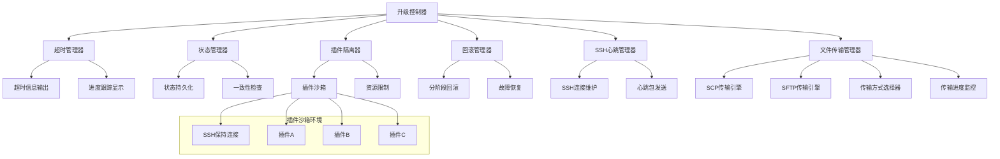
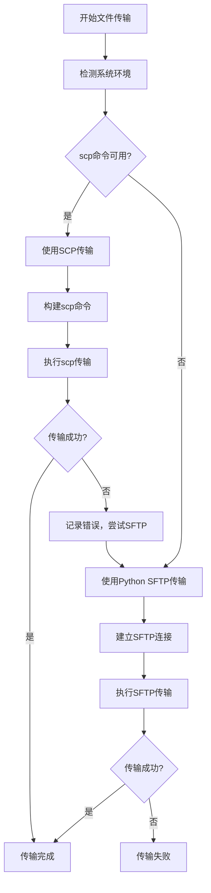
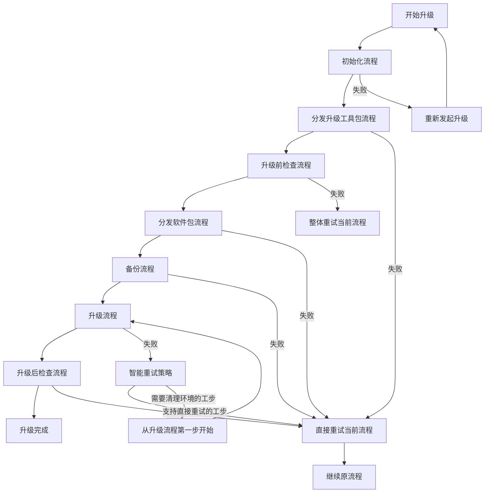
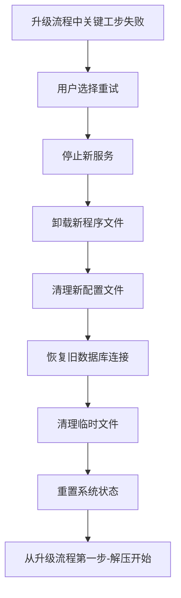
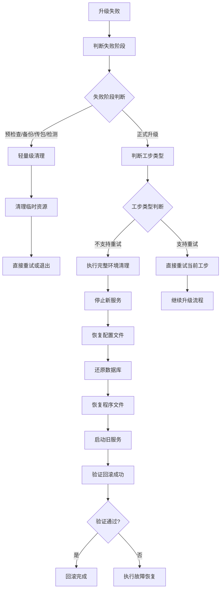
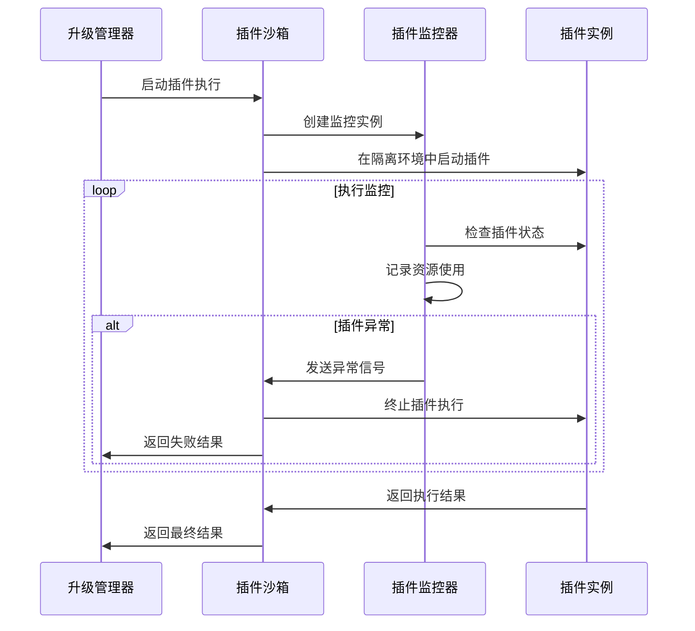

# 灾备产品升级工具健壮性优化设计

## 1. 概述

本设计文档针对当前升级工具在实际使用中遇到的核心问题，提出了一套轻量级的优化方案。主要解决超时失败频发、回滚不可靠、插件间相互影响等关键问题，提升系统的健壮性和可靠性。

### 1.1 问题分析

当前系统存在的主要问题：
- **超时信息不完善**：超时发生时缺乏详细的错误信息输出，无法明确哪一步超时、为什么超时、超过多少时间
- **插件隔离不足**：各部门提交的升级插件执行失败时相互影响
- **重试机制缺乏**：缺乏明确的重试机制
- **状态管理混乱**：升级过程中状态不一致导致的各种问题
- **SSH连接稳定性问题**：长时间升级过程中SSH连接容易超时断开，导致升级中断

### 1.2 设计目标

- 保持现有超时机制，重点增强超时报错的详细信息输出
- 增强回滚机制的可靠性，确保能够稳定回滚到升级前状态
- 实现插件沙箱隔离，避免插件间相互影响
- 建立统一的重试策略和错误处理体系
- 完善升级流程的状态管理和环境清理机制
- 增强SSH连接的稳定性，防止长时间操作中连接断开

## 2. 技术栈与依赖

### 2.1 现有技术栈
- **核心语言**: Python 3.x
- **构建系统**: CMake
- **远程操作**: SSH/SFTP
- **配置管理**: INI + JSON

### 2.2 新增轻量级依赖
- **进程隔离**: subprocess
- **状态持久化**: JSON/INI配置文件
- **配置验证**: jsonschema

## 3. 架构优化设计

### 3.1 整体架构调整



### 3.2 核心组件设计

#### 3.2.1 超时信息管理器

**核心职责：**
- 保持现有超时配置和逻辑完全不变
- 在超时发生时提供详细的错误信息输出
- 明确显示具体哪一步超时、为什么超时、超过多少时间
- 实时显示操作进度，帮助用户了解升级状态

**主要功能模块：**
- 超时信息格式化器：统一超时错误的输出格式和内容
- 进度跟踪显示器：实时显示长时间操作的执行进度
- 超时预警系统：在接近超时时提前发出警告
- 环境上下文收集器：超时时自动收集系统状态信息

#### 3.2.2 插件隔离执行器

**核心职责：**
- 在隔离环境中安全执行各类升级插件
- 对插件执行进程实施资源限制和监控
- 防止插件失败对主升级流程造成影响

**主要功能模块：**
- 进程隔离管理：创建和管理独立的插件执行环境
- 健康监控系统：实时监控插件执行状态

#### 3.2.3 SSH心跳管理器

**核心职责：**
- 维护SSH连接的长期稳定性，防止超时断开
- 按连接类型提供差异化的心跳策略
- 在连接断开时提供智能重连机制

**主要功能模块：**
- 心跳发送引擎：定时发送保活数据包
- 连接状态监控：实时检测连接健康状态
- 重连管理器：连接丢失后的自动恢复逻辑

#### 3.2.5 文件传输管理器

**核心职责：**
- 智能选择最优的文件传输方式，提升传输性能
- 提供统一的文件传输接口，对上层业务逻辑透明
- 实现传输方式的自动降级和错误处理

**主要功能模块：**
- SCP传输引擎：优先使用系统原生scp命令进行高性能传输
- SFTP传输引擎：Python SFTP兜底传输方式，保证兼容性
- 传输方式选择器：检测系统环境并自动选择最优传输方式
- 传输进度监控：实时监控传输进度和速度

## 4. 核心功能设计

### 4.1 文件传输性能优化

#### 4.1.1 传输方式智能选择机制

**设计原则：**
- 优先使用系统原生scp命令，性能优于Python SFTP
- 自动检测系统环境，智能选择最优传输方式
- 保持向后兼容，确保在任何环境下都能正常工作
- 统一的传输接口，对上层业务逻辑透明

**传输方式优先级：**

| 优先级 | 传输方式 | 检测条件 | 性能特点 | 适用场景 |
|-------|---------|----------|----------|----------|
| 1 | 系统SCP命令 | 系统中存在scp命令 | 高性能，原生优化 | 大文件传输，批量文件 |
| 2 | Python SFTP | scp不可用时 | 跨平台兼容性好 | 小文件传输，兜底方案 |

#### 4.1.2 SCP传输实现设计

**SCP命令检测机制：**
```
检测流程：
1. 使用subprocess.run(['which', 'scp'])检测scp命令是否存在
2. 如果which命令不存在，尝试直接执行scp --version
3. 检测成功则启用SCP传输模式
4. 检测失败则降级到Python SFTP模式
```

**认证信息获取：**
- 用户名和密码默认从配置文件获取
- 支持SSH密钥认证和密码认证两种方式
- 配置文件结构：
  ```
  [ssh_config]
  username = [用户名]
  password = [密码]
  private_key_path = [私钥路径，可选]
  ```

**SCP传输命令构建：**
```
基础命令格式：
scp [选项] [源文件] [用户名@目标主机:目标路径]

选项设置：
-o StrictHostKeyChecking=no    # 跳过主机密钥检查
-o UserKnownHostsFile=/dev/null # 不保存主机密钥
-o ConnectTimeout=30           # 连接超时设置
-C                             # 启用压缩传输
-p                             # 保持文件权限和时间戳
-r                             # 递归传输目录
```

#### 4.1.3 传输管理器统一接口设计

**接口抽象设计：**

传输管理器提供统一的文件传输接口，内部自动选择最优传输方式：

```
传输管理器类设计：
class FileTransferManager:
    - __init__(config): 初始化传输管理器
    - detect_transfer_method(): 检测可用的传输方式
    - upload_file(local_path, remote_path, host_info): 上传单个文件
    - upload_directory(local_dir, remote_dir, host_info): 上传目录
    - download_file(remote_path, local_path, host_info): 下载文件
    - get_transfer_progress(): 获取传输进度信息
```

**传输策略选择逻辑：**



#### 4.1.4 错误处理和降级机制

**错误分类处理：**

| 错误类型 | SCP错误处理 | 降级策略 | 重试机制 |
|---------|-------------|----------|----------|
| 命令不存在 | 自动降级到SFTP | 立即切换 | 不重试 |
| 认证失败 | 检查用户名密码配置 | 不降级 | 重试3次 |
| 网络超时 | 调整超时参数 | 可选降级 | 重试3次 |
| 权限不足 | 提示权限问题 | 不降级 | 不重试 |
| 磁盘空间不足 | 提示空间不足 | 不降级 | 不重试 |

**降级机制设计：**
```
降级触发条件：
1. scp命令执行失败且错误码为"命令未找到"
2. scp传输多次重试后仍然失败
3. 用户在配置中强制指定使用SFTP模式

降级处理流程：
1. 记录降级原因和时间
2. 切换到Python SFTP传输模式
3. 使用相同的认证信息建立SFTP连接
4. 继续执行文件传输任务
```

#### 4.1.5 传输进度监控和日志

**进度监控机制：**
- SCP传输：解析scp命令输出的进度信息
- SFTP传输：使用callback机制实时获取传输进度
- 统一的进度显示格式：文件名、传输速度、完成百分比、剩余时间

**日志记录设计：**
```
日志内容：
- 传输方式选择结果（SCP/SFTP）
- 传输开始时间和结束时间
- 文件大小和传输速度
- 传输成功/失败状态
- 错误信息和降级记录

日志格式示例：
[2024-01-01 10:00:00] [INFO] 检测到scp命令，启用SCP传输模式
[2024-01-01 10:00:01] [INFO] 开始传输文件: upgrade-package.tar.gz (1.2GB)
[2024-01-01 10:02:15] [INFO] 传输完成: 平均速度 9.5MB/s，耗时 2分15秒
[2024-01-01 10:02:16] [WARN] SCP传输失败，降级到SFTP模式
```

### 4.2 升级流程与重试策略

#### 4.2.1 升级流程定义

版本升级分为七个主要流程：

1. **初始化流程** - 加载软件包和升级工具、加载节点SSH信息
2. **分发升级工具包流程** - 上传升级工具包到各节点
3. **升级前检查流程** - 环境适配性检查和系统检查
4. **分发软件包流程** - 上传软件包到各节点
5. **备份流程** - 系统和数据备份
6. **升级流程** - 安装和部署新版本
7. **升级后检查流程** - 功能验证和性能检查



#### 4.2.2 重试策略详细规则

| 流程阶段 | 工步内容 | 失败处理策略 | 重试操作 | 环境清理需求 |
|----------|----------|----------------|----------|----------------|
| **初始化流程** | 加载软件包、升级工具 | 重新发起升级 | 从头开始重新升级 | 完全清理，重新开始 |
| | 加载节点SSH信息 | 重新发起升级 | 从头开始重新升级 | 完全清理，重新开始 |
| **分发升级工具包流程** | 上传升级工具包 | 支持直接重试 | 直接重试当前工步 | 清理残留文件后重试 |
| **升级前检查流程** | 所有检查项目 | 整体重试 | 统一收集报错信息后整体重试 | 无需清理 |
| **分发软件包流程** | 上传软件包 | 支持直接重试 | 直接重试当前工步 | 检查并清理不完整文件 |
| **备份流程** | 停止业务服务 | 支持直接重试 | 直接重试当前工步 | 无需清理 |
| | 备份数据库 | 支持直接重试 | 检查已备份状态后重试 | 删除不完整备份 |
| | 停止数据库服务 | 支持直接重试 | 直接重试当前工步 | 无需清理 |
| | 备份本地数据 | 支持直接重试 | 检查备份标识后重试 | 清理不完整备份 |
| | 自定义插件 | 支持直接重试 | 直接重试当前工步 | 无需清理 |
| | 删除服务 | 支持直接重试 | 直接重试当前工步 | 无需清理 |
| **升级流程** | 解压 | 支持直接重试 | 清理残留后直接重试 | 删除解压目录和服务 |
| | 安装前配置升级 | 从解压开始重试 | 从升级流程第一步开始 | 完整环境清理 |
| | 升级模式安装 | 从解压开始重试 | 从升级流程第一步开始 | 完整环境清理 |
| | 启动数据库服务 | 支持直接重试 | 直接重试当前工步 | 无需清理 |
| | 启动KMC服务 | 支持直接重试 | 直接重试当前工步 | 无需清理 |
| | 启动Etcd服务 | 支持直接重试 | 检查集群状态后重试 | 无需清理 |
| | 初始化数据库管理员用户 | 支持直接重试 | 检查用户存在后重试 | 无需清理 |
| | 导入数据库数据 | 支持直接重试 | 直接重试当前工步 | 无需清理 |
| | 创建新服务数据库 | 支持直接重试 | 直接重试当前工步 | 无需清理 |
| | 执行数据库migrate | 从解压开始重试 | 从升级流程第一步开始 | 完整环境清理 |
| | 安装后配置升级 | 从解压开始重试 | 从升级流程第一步开始 | 完整环境清理 |
| | 数据库数据升级 | 从解压开始重试 | 从升级流程第一步开始 | 完整环境清理 |
| | 启动服务 | 支持直接重试 | 直接重试当前工步 | 无需清理 |
| **升级后检查流程** | 检查所有服务是否启动 | 支持直接重试 | 直接重试当前工步 | 无需清理 |

#### 4.2.3 升级子流程可重试实现机制

##### 4.2.3.1 上传升级工具包

**重试前检查机制：**
- 检查上传目录下是否已有解压好的升级工具包
- 如果已存在，执行删除已解压的升级工具包目录操作
- 继续执行原上传升级工具包流程

**传输性能优化集成：**
- 优先使用系统原生scp命令进行工具包传输
- 如果scp不可用，自动降级到Python SFTP传输
- 使用统一的传输管理器接口，对上层业务逻辑透明
- 自动从配置文件获取SSH认证信息

**实现策略：**
- 目录存在性检查：检查目标节点的工具包解压目录
- 强制清理机制：删除残留的工具包文件和目录
- 智能传输选择：自动检测并选择最优传输方式
- 重新上传验证：确保工具包完整性和可执行性
- 传输进度监控：实时显示传输进度和速度信息

##### 4.2.3.2 上传软件包

**重试前检查机制：**
- 上传前检查对应节点的上传目录下是否已存在软件包
- 如果已存在，比对软件包的sha256值是否相同
- 如果sha256值不同，删除该软件包并重新上传
- 如果sha256值相同，直接跳过上传步骤

**传输性能优化集成：**
- 优先使用系统原生scp命令进行软件包传输，特别适合大文件
- scp不可用时自动使用Python SFTP传输方式
- 支持断点续传功能，针对大型软件包传输中断的情况
- 使用压缩传输选项，提高传输效率

**实现策略：**
- 文件完整性校验：使用sha256算法验证文件完整性
- 增量上传机制：只上传缺失或损坏的文件部分
- 智能传输选择：根据文件大小和系统环境选择最优传输方式
- 断点续传支持：支持大文件的断点续传功能
- 传输速度监控：实时显示传输速度和预计剩余时间

##### 4.2.3.3 备份数据库

**重试前检查机制：**
- 先检查该服务的数据库是否已备份过
- 如果已备份过则直接跳过当前备份步骤
- 检查方式：到备份目录下查找是否存在该服务导出的数据库SQL文件
- 完整性验证：判断SQL文件最后一行是否包含"Dump completed"标识

**实现策略：**
- 备份状态标识：在备份目录创建状态标识文件
- 备份完整性校验：验证备份文件的完整性和可用性
- 增量备份支持：支持基于时间戳的增量备份机制

##### 4.2.3.4 备份本地数据

**重试前检查机制：**
- 判断备份软件包是否已完成，如果完成则跳过
- 检查方式：在本地配置文件中查找备份完成标记
- 备份完成后会在本地配置文件中标记"备份软件完成"状态

**实现策略：**
- 状态持久化：使用JSON配置文件记录备份状态
- 原子操作保证：确保备份标记的原子性写入
- 备份验证机制：验证备份数据的完整性和可恢复性

##### 4.2.3.5 解压操作

**重试前检查机制：**
- 检查环境是否有残留：判断安装目录下是否已有解压好的软件目录
- 清理残留：如果已有解压好的目录，首先尝试删除服务
- 环境清理：删除之前解压的软件目录和相关文件
- 开始解压：在清理完成后重新开始解压操作

**实现策略：**
- 环境状态检测：全面检查安装目录的状态
- 服务停止机制：安全停止可能正在运行的服务
- 目录强制清理：强制删除残留的解压目录和文件
- 解压完整性验证：确保解压操作的完整性

##### 4.2.3.6 启动Etcd服务

**重试前检查机制：**
- Etcd服务的clusteradd脚本需要改造
- 改造内容：如果传入的Etcd的endpoint已被添加到集群中时，直接退出
- 避免重复添加：防止重试时重复添加相同的节点到Etcd集群

**实现策略：**
- 集群状态检查：检查当前节点是否已在Etcd集群中
- 智能跳过机制：已存在的节点直接跳过添加操作
- 集群健康检查：验证Etcd集群的健康状态

##### 4.2.3.7 初始化数据库管理员用户

**重试前检查机制：**
- 检查使用sdba用户是否可以正常连接数据库
- 如果可以正常连接，则不调用DBTool工具创建数据库管理员用户
- 非主节点的控制节点也执行该子流程
- 从节点的数据库也需要执行DBTool创建sdba用户

**特殊处理：**
- 主从节点同步问题：DBTool创建sdba用户的SQL语句可能存在同步问题
- 根本原因分析：怀疑与使用update语句更新root用户名和密码有关
- 解决方案：确保主节点执行后从节点能正确同步相关数据

**实现策略：**
- 连接测试机制：使用sdba用户尝试连接数据库
- 用户存在性检查：检查sdba用户是否已正确创建
- 主从同步验证：确保用户信息在主从节点间正确同步

#### 4.2.4 升级检查内容变更设计

##### 4.2.4.1 NetworkManager检查变更

**原有逻辑：**
- 除了UOS、麒麟、OpenEuler系统之外检查到NetworkManager服务运行则升级检查失败

**新的检查逻辑：**
- 除了UOS、麒麟、OpenEuler系统之外检查network和NetworkManager两个服务
- 如果network和NetworkManager两个服务同时运行，则升级检查失败
- 如果只有其中一个服务运行，则检查通过

**检查机制设计：**
```
检查条件：
1. 系统类型不是UOS、麒麟、OpenEuler
2. 同时检查network服务状态和NetworkManager服务状态
3. 两个服务都处于运行状态时才报错

报错信息：
"检查失败：network和NetworkManager服务同时运行，可能导致网络冲突"
```

##### 4.2.4.2 补丁检查机制

**检查逻辑：**
- 检查各节点是否打过系统补丁
- 如果检查到节点打过补丁，则会提示用户确认是否继续升级
- 不强制阻止升级，但需要用户明确确认

**检查机制设计：**
```
检查方式：
1. 检查系统补丁安装记录
2. 识别已安装的补丁类型和版本
3. 评估补丁对升级的潜在影响

用户交互：
"发现节点[节点名]已安装补丁[补丁信息]，可能影响升级兼容性，是否继续升级？(Y/N)"
```

##### 4.2.4.3 SELinux状态检查

**新增检查项：**
- 使用getenforce命令检查SELinux状态
- 检查SELinux状态是否为Disabled
- 如果不是Disabled状态，则升级检查失败

**检查机制设计：**
```
检查命令：getenforce
期望结果：Disabled
失败处理：
- 如果结果为Enforcing或Permissive，则报错
- 报错信息："SELinux状态检查失败，当前状态为[状态]，升级要求SELinux为Disabled状态"
- 建议操作："请执行 'setenforce 0' 和修改 '/etc/selinux/config' 文件禁用SELinux"
```

##### 4.2.4.4 系统用户2048检查

**新增检查项：**
- 检查/etc/passwd文件是否存在两个2048系统用户信息
- 检查范围包括用户信息和注释内容
- 如果存在多个2048用户，则升级检查失败

**检查机制设计：**
```
检查逻辑：
1. 读取/etc/passwd文件内容
2. 搜索用户ID为2048的用户记录
3. 同时检查注释字段中包含2048的记录
4. 统计符合条件的记录数量

判断条件：
- 如果找到超过一个2048用户记录，则检查失败
- 报错信息："系统用户检查失败，发现多个2048用户，可能导致权限冲突"
- 建议操作："请检查并清理重复的2048系统用户"
```

#### 4.2.5 环境清理策略

对于需要从升级流程第一步开始重试的工步，重试前需要执行完整的环境清理：



#### 4.3 超时机制信息输出优化

#### 4.3.1 超时策略

**核心原则：保持原有超时机制完全不变，重点优化超时报错的信息输出**

| 策略类型 | 应用场景 | 实现方式 |
|---------|---------|----------|
| 原有超时配置 | 所有升级操作 | 保持使用配置文件中的预设值，不做任何修改 |
| **超时信息输出** | **超时发生时** | **详细输出哪一步、为什么超时、超过多少** |
| 超时进度跟踪 | 长时间操作 | 实时显示操作进度和剩余时间 |
| 超时预警机制 | 接近超时时 | 提前预警即将超时的操作 |

#### 4.3.2 超时信息输出机制

**超时报错信息设计：**

当升级操作发生超时时，系统需要输出详细的超时信息：

| 信息类型 | 输出内容 | 输出格式 |
|---------|---------|----------|
| 操作步骤信息 | 当前正在执行的具体步骤 | "[操作阶段] 具体操作名称" |
| 超时原因分析 | 为什么会发生超时 | "超时原因: 具体原因描述" |
| 超时时间详情 | 配置超时、实际执行时间 | "超时设置: Xs, 实际执行: Ys" |
| 环境上下文 | 当前系统状态和资源情况 | "CPU: X%, 内存: X%, 磁盘: X%" |

**超时信息输出示例：**
```
[错误] 升级操作超时
操作步骤: [数据库迁移] 执行数据库结构升级脚本
超时原因: 数据库操作复杂度高，大表重建索引耗时过长
超时设置: 1800秒 (30分钟)
实际执行: 2100秒 (35分钟)
超出时间: 300秒 (5分钟)
当前环境: CPU: 85%, 内存: 78%, 磁盘IO: 92%
建议操作: 请检查数据库性能或考虑在低峰期执行升级
```

#### 4.3.3 超时进度跟踪和预警

**实时进度显示：**

为长时间操作提供实时的进度信息显示：

| 显示内容 | 更新频率 | 输出格式 |
|---------|---------|----------|
| 操作进度 | 每10秒 | "[进度] 35% (7/20 完成)" |
| 剩余时间 | 每30秒 | "预计剩余: 15分钟" |
| 超时预警 | 超时85%时 | "警告: 操作即将超时, 剩余2分钟" |
| 资源状态 | 每60秒 | "CPU: 75%, 内存: 60%, IO: 80%" |

**超时预警机制：**

在操作接近超时时提前发出预警：

- **第一次预警**：达到超时85%时发出预警
- **第二次预警**：达到超时95%时发出紧急预警
- **超时报错**：达到100%时输出详细超时信息

**进度跟踪输出示例：**
```
[信息] 正在执行: [数据库迁移] 更新表结构
[进度] 45% (9/20 表已完成), 预计剩余: 12分钟
[状态] CPU: 78%, 内存: 65%, 磁盘IO: 85%

[警告] 操作即将超时, 剩余3分钟 (已用时: 27分钟/30分钟)
[紧急] 操作即将超时, 剩余1.5分钟 (已用时: 28.5分钟/30分钟)
```

#### 4.3.4 超时错误分类和处理

**超时错误分类：**

根据不同的超时场景提供针对性的错误信息：

| 超时类型 | 可能原因 | 输出信息 | 建议操作 |
|---------|---------|---------|----------|
| 网络超时 | 网络延迟、连接不稳定 | "网络连接超时, 连接延迟: Xms" | 检查网络状态，考虑重试 |
| 数据库超时 | 数据量大、索引重建 | "数据库操作超时, 数据量: XGB" | 考虑在低峰期执行 |
| 文件操作超时 | 文件大、磁盘IO慢 | "文件处理超时, 文件大小: XMB" | 检查磁盘空间和性能 |
| 服务启动超时 | 资源不足、依赖缺失 | "服务启动超时, 端口: X" | 检查系统资源和依赖 |
| 插件执行超时 | 插件逻辑复杂、死循环 | "插件执行超时: [插件名]" | 检查插件日志，考虑跳过 |

**超时上下文信息收集：**

超时发生时自动收集环境信息用于分析：

- 系统资源使用情况 (CPU, 内存, 磁盘, 网络)
- 当前正在运行的进程和线程
- 数据库连接数和正在执行的SQL
- 网络连接状态和流量情况
- 日志文件中的错误和警告信息

### 4.4 增强回滚机制

#### 4.4.1 分阶段回滚策略

| 回滚阶段 | 回滚内容 | 验证方式 | 失败处理 |
|---------|---------|----------|----------|
| 预检查阶段回滚 | 清理临时文件 | 文件存在性检查 | 手动清理 |
| 备份阶段回滚 | 删除不完整备份 | 备份完整性验证 | 重新创建备份目录 |
| 传包阶段回滚 | 删除上传文件 | 文件清理验证 | 强制删除 |
| 升级阶段回滚 | 完整系统回滚 | 服务状态+数据一致性 | 分段回滚+修复 |
| 检测阶段回滚 | 部分回滚+修复 | 功能可用性检查 | 增量修复 |

#### 4.4.2 智能回滚决策树

根据失败阶段和失败类型，自动选择最优回滚策略：



### 4.5 插件隔离与管理

#### 4.5.1 插件分类与隔离级别

| 插件类型 | 风险等级 | 隔离策略 | 资源限制 |
|---------|---------|----------|----------|
| 核心系统插件 | 低 | 线程隔离 | 内存: 512MB, CPU: 50% |
| 业务逻辑插件 | 中 | 进程隔离 | 内存: 256MB, CPU: 30% |
| 第三方插件 | 高 | 容器隔离 | 内存: 128MB, CPU: 20% |
| 数据库插件 | 高 | 进程隔离+事务管理 | 内存: 1GB, CPU: 60% |

#### 4.5.2 插件执行流程与重试策略



#### 4.5.3 插件失败处理策略

对于插件执行失败，根据插件类型和关键级别采取不同策略：

| 插件类型 | 关键级别 | 失败处理 | 重试策略 |
|---------|---------|----------|----------|
| 核心系统插件 | 高 | 停止升级，强制回滚 | 最多3次，间隔时间10s |
| 业务逻辑插件 | 中 | 跳过插件，继续升级 | 最多2次，间隔时间5s |
| 第三方插件 | 低 | 记录错误，继续升级 | 最多1次，无间隔 |


### 4.6 SSH心跳维护机制

#### 4.6.1 SSH连接维护策略

在升级过程中，所有SSH连接默认启用心跳维护机制，防止长时间操作导致连接超时断开：

| 连接类型 | 心跳间隔 | 超时检测 | 重连策略 |
|---------|---------|----------|----------|
| 主控制连接 | 60秒 | 180秒 | 自动重连3次 |
| 文件传输连接 | 30秒 | 120秒 | 自动重连2次 |
| 插件执行连接 | 45秒 | 150秒 | 自动重连1次 |
| 状态检查连接 | 90秒 | 300秒 | 手动重连 |

#### 4.6.2 心跳机制设计

**心跳策略设计：**
- 分类管理：根据连接类型设置不同的心跳参数
- 自适应调整：根据网络延迟动态调整心跳间隔
- 失败重试：心跳失败时的逐级重试机制

**连接管理流程：**
1. 连接建立后自动启动心跳线程
2. 定时发送保活数据包维持连接
3. 实时监控连接状态，发现断开立即处理
4. 连接丢失时执行智能重连逻辑
5. 连接关闭时自动停止心跳线程

**重连策略设计：**
- 指数退避：重连间隔逐次增加
- 最大重试限制：按连接类型设置不同的重试上限
- 失败上报：达到重试上限后向上层报告连接不可恢复

#### 4.6.3 SSH连接管理器增强

对现有的SSHClient类进行增强，默认启用心跳机制：

**增强功能设计：**
- 自动心跳启动：登录成功后自动开启心跳维护
- 透明集成：在原有命令执行接口中集成心跳检查
- 分类管理：根据连接用途选择合适的心跳策略
- 生命周期管理：连接创建到销毁的全过程心跳管理

```
