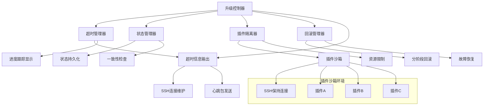
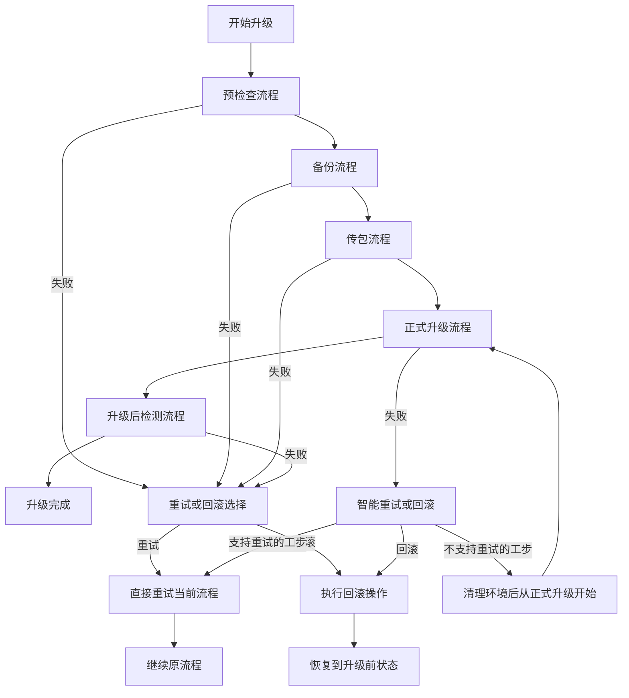
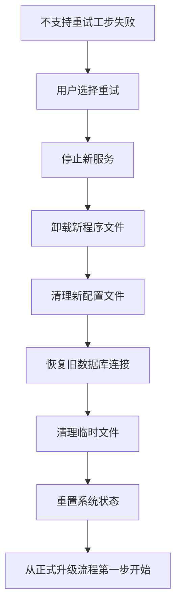
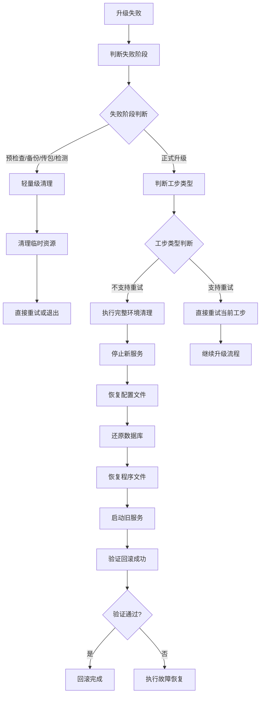
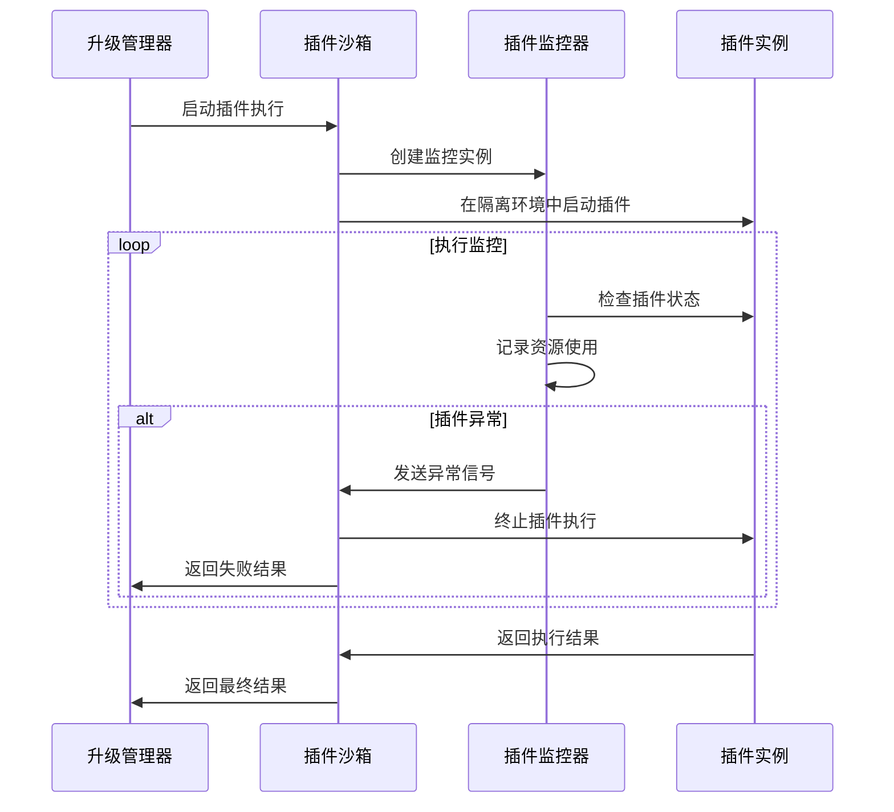

# 灾备产品升级工具健壮性优化设计

## 1. 概述

本设计文档针对当前灾备产品升级工具在实际使用中遇到的核心问题，提出了一套轻量级的优化方案。主要解决超时失败频发、回滚不可靠、插件间相互影响等关键问题，在不引入复杂分布式架构的前提下，显著提升系统的健壮性和可靠性。

### 1.1 问题分析

当前系统存在的主要问题：
- **超时信息不完善**：超时发生时缺乏详细的错误信息输出，无法明确哪一步超时、为什么超时、超过多少时间
- **回滚机制脆弱**：回滚失败后缺乏有效的恢复手段，只能回滚到升级前状态
- **插件隔离不足**：各部门提交的升级插件执行失败时相互影响
- **重试策略不统一**：不同阶段的重试逻辑混乱，缺乏明确的重试规则
- **状态管理混乱**：升级过程中状态不一致导致的各种问题
- **SSH连接稳定性问题**：长时间升级过程中SSH连接容易超时断开，导致升级中断

### 1.2 设计目标

- 保持现有超时机制，重点增强超时报错的详细信息输出
- 增强回滚机制的可靠性，确保能够稳定回滚到升级前状态
- 实现插件沙箱隔离，避免插件间相互影响
- 建立统一的重试策略和错误处理体系
- 完善升级流程的状态管理和环境清理机制
- 增强SSH连接的稳定性，防止长时间操作中连接断开
- 保持现有架构的简洁性，避免引入复杂的分布式组件

## 2. 技术栈与依赖

### 2.1 现有技术栈
- **核心语言**: Python 3.x
- **构建系统**: CMake
- **远程操作**: SSH/SFTP (paramiko)
- **配置管理**: INI + JSON
- **日志系统**: Python logging

### 2.2 新增轻量级依赖
- **进程隔离**: subprocess + resource限制
- **状态持久化**: JSON/INI配置文件
- **配置验证**: jsonschema
- **资源监控**: psutil (系统资源监控)
- **SSH心跳维护**: paramiko keepalive机制

## 3. 架构优化设计

### 3.1 整体架构调整



### 3.2 核心组件设计

#### 3.2.1 超时信息管理器

**核心职责：**
- 保持现有超时配置和逻辑完全不变
- 在超时发生时提供详细的错误信息输出
- 明确显示具体哪一步超时、为什么超时、超过多少时间
- 实时显示操作进度，帮助用户了解升级状态

**主要功能模块：**
- 超时信息格式化器：统一超时错误的输出格式和内容
- 进度跟踪显示器：实时显示长时间操作的执行进度
- 超时预警系统：在接近超时时提前发出警告
- 环境上下文收集器：超时时自动收集系统状态信息

#### 3.2.2 插件隔离执行器

**核心职责：**
- 在隔离环境中安全执行各类升级插件
- 对插件执行进程实施资源限制和监控
- 防止插件失败对主升级流程造成影响

**主要功能模块：**
- 进程隔离管理：创建和管理独立的插件执行环境
- 资源限制引擎：控制插件的CPU、内存使用
- 健康监控系统：实时监控插件执行状态

#### 3.2.3 SSH心跳管理器

**核心职责：**
- 维护SSH连接的长期稳定性，防止超时断开
- 按连接类型提供差异化的心跳策略
- 在连接断开时提供智能重连机制

**主要功能模块：**
- 心跳发送引擎：定时发送保活数据包
- 连接状态监控：实时检测连接健康状态
- 重连管理器：连接丢失后的自动恢复逻辑

#### 3.2.4 状态管理器

**核心职责：**
- 使用JSON文件持久化升级过程中的关键状态
- 管理升级检查点，支持断点恢复和状态回溯
- 记录操作历史和插件执行情况用于分析优化

**主要功能模块：**
- 检查点管理：创建、更新、查询升级检查点
- 历史数据管理：记录和统计操作执行时间
- 文件安全管理：原子写入和数据一致性保证

## 4. 核心功能设计

### 4.1 升级流程与重试策略

#### 4.1.1 升级流程定义

版本升级分为五个主要流程：

1. **预检查流程** - 环境适配性检查
2. **备份流程** - 系统和数据备份
3. **传包流程** - 升级包上传和分发
4. **正式升级流程** - 安装和部署新版本
5. **升级后检测流程** - 功能验证和性能检查



#### 4.1.2 重试策略详细规则

| 流程阶段 | 失败处理策略 | 重试操作 | 环境清理需求 |
|----------|----------------|----------|----------------|
| 预检查流程 | 支持直接重试/回滚 | 直接重试当前流程 | 无需清理 |
| 备份流程 | 支持直接重试/回滚 | 直接重试当前流程 | 无需清理 |
| 传包流程 | 支持直接重试/回滚 | 直接重试当前流程 | 无需清理 |
| 正式升级流程 | 智能重试策略 | 按工步类型处理 | 按需清理 |
| 升级后检测流程 | 支持直接重试/回滚 | 直接重试当前流程 | 无需清理 |

#### 4.1.3 正式升级流程的工步分类

**支持重试的工步：**
- 服务停止操作
- 配置文件更新
- 数据库连接测试
- 日志文件初始化
- 权限设置操作

**不支持重试的工步：**
- 程序文件安装/替换
- 数据库结构升级
- 系统服务注册
- 核心配置初始化
- 许可证更新

#### 4.1.4 环境清理策略

对于不支持重试的工步，重试前需要执行完整的环境清理：



#### 4.2 超时机制信息输出优化

#### 4.2.1 超时策略

**核心原则：保持原有超时机制完全不变，重点优化超时报错的信息输出**

| 策略类型 | 应用场景 | 实现方式 |
|---------|---------|----------|
| 原有超时配置 | 所有升级操作 | 保持使用配置文件中的预设值，不做任何修改 |
| **超时信息输出** | **超时发生时** | **详细输出哪一步、为什么超时、超过多少** |
| 超时进度跟踪 | 长时间操作 | 实时显示操作进度和剩余时间 |
| 超时预警机制 | 接近超时时 | 提前预警即将超时的操作 |

#### 4.2.2 超时信息输出机制

**超时报错信息设计：**

当升级操作发生超时时，系统需要输出详细的超时信息：

| 信息类型 | 输出内容 | 输出格式 |
|---------|---------|----------|
| 操作步骤信息 | 当前正在执行的具体步骤 | "[操作阶段] 具体操作名称" |
| 超时原因分析 | 为什么会发生超时 | "超时原因: 具体原因描述" |
| 超时时间详情 | 配置超时、实际执行时间 | "超时设置: Xs, 实际执行: Ys" |
| 环境上下文 | 当前系统状态和资源情况 | "CPU: X%, 内存: X%, 磁盘: X%" |

**超时信息输出示例：**
```
[错误] 升级操作超时
操作步骤: [数据库迁移] 执行数据库结构升级脚本
超时原因: 数据库操作复杂度高，大表重建索引耗时过长
超时设置: 1800秒 (30分钟)
实际执行: 2100秒 (35分钟)
超出时间: 300秒 (5分钟)
当前环境: CPU: 85%, 内存: 78%, 磁盘IO: 92%
建议操作: 请检查数据库性能或考虑在低峰期执行升级
```

#### 4.2.3 超时进度跟踪和预警

**实时进度显示：**

为长时间操作提供实时的进度信息显示：

| 显示内容 | 更新频率 | 输出格式 |
|---------|---------|----------|
| 操作进度 | 每10秒 | "[进度] 35% (7/20 完成)" |
| 剩余时间 | 每30秒 | "预计剩余: 15分钟" |
| 超时预警 | 超时85%时 | "警告: 操作即将超时, 剩余2分钟" |
| 资源状态 | 每60秒 | "CPU: 75%, 内存: 60%, IO: 80%" |

**超时预警机制：**

在操作接近超时时提前发出预警：

- **第一次预警**：达到超时85%时发出预警
- **第二次预警**：达到超时95%时发出紧急预警
- **超时报错**：达到100%时输出详细超时信息

**进度跟踪输出示例：**
```
[信息] 正在执行: [数据库迁移] 更新表结构
[进度] 45% (9/20 表已完成), 预计剩余: 12分钟
[状态] CPU: 78%, 内存: 65%, 磁盘IO: 85%

[警告] 操作即将超时, 剩余3分钟 (已用时: 27分钟/30分钟)
[紧急] 操作即将超时, 剩余1.5分钟 (已用时: 28.5分钟/30分钟)
```

#### 4.2.4 超时错误分类和处理

**超时错误分类：**

根据不同的超时场景提供针对性的错误信息：

| 超时类型 | 可能原因 | 输出信息 | 建议操作 |
|---------|---------|---------|----------|
| 网络超时 | 网络延迟、连接不稳定 | "网络连接超时, 连接延迟: Xms" | 检查网络状态，考虑重试 |
| 数据库超时 | 数据量大、索引重建 | "数据库操作超时, 数据量: XGB" | 考虑在低峰期执行 |
| 文件操作超时 | 文件大、磁盘IO慢 | "文件处理超时, 文件大小: XMB" | 检查磁盘空间和性能 |
| 服务启动超时 | 资源不足、依赖缺失 | "服务启动超时, 端口: X" | 检查系统资源和依赖 |
| 插件执行超时 | 插件逻辑复杂、死循环 | "插件执行超时: [插件名]" | 检查插件日志，考虑跳过 |

**超时上下文信息收集：**

超时发生时自动收集环境信息用于分析：

- 系统资源使用情况 (CPU, 内存, 磁盘, 网络)
- 当前正在运行的进程和线程
- 数据库连接数和正在执行的SQL
- 网络连接状态和流量情况
- 日志文件中的错误和警告信息

### 4.3 增强回滚机制

#### 4.3.1 分阶段回滚策略

| 回滚阶段 | 回滚内容 | 验证方式 | 失败处理 |
|---------|---------|----------|----------|
| 预检查阶段回滚 | 清理临时文件 | 文件存在性检查 | 手动清理 |
| 备份阶段回滚 | 删除不完整备份 | 备份完整性验证 | 重新创建备份目录 |
| 传包阶段回滚 | 删除上传文件 | 文件清理验证 | 强制删除 |
| 升级阶段回滚 | 完整系统回滚 | 服务状态+数据一致性 | 分段回滚+修复 |
| 检测阶段回滚 | 部分回滚+修复 | 功能可用性检查 | 增量修复 |

#### 4.3.2 智能回滚决策树

根据失败阶段和失败类型，自动选择最优回滚策略：



### 4.4 插件隔离与管理

#### 4.4.1 插件分类与隔离级别

| 插件类型 | 风险等级 | 隔离策略 | 资源限制 |
|---------|---------|----------|----------|
| 核心系统插件 | 低 | 线程隔离 | 内存: 512MB, CPU: 50% |
| 业务逻辑插件 | 中 | 进程隔离 | 内存: 256MB, CPU: 30% |
| 第三方插件 | 高 | 容器隔离 | 内存: 128MB, CPU: 20% |
| 数据库插件 | 高 | 进程隔离+事务管理 | 内存: 1GB, CPU: 60% |

#### 4.4.2 插件执行流程与重试策略



#### 4.4.3 插件失败处理策略

对于插件执行失败，根据插件类型和关键级别采取不同策略：

| 插件类型 | 关键级别 | 失败处理 | 重试策略 |
|---------|---------|----------|----------|
| 核心系统插件 | 高 | 停止升级，强制回滚 | 最多3次，间隔时间10s |
| 业务逻辑插件 | 中 | 跳过插件，继续升级 | 最多2次，间隔时间5s |
| 第三方插件 | 低 | 记录错误，继续升级 | 最多1次，无间隔 |
### 4.6 SSH心跳维护机制

#### 4.6.1 SSH连接维护策略

在升级过程中，所有SSH连接默认启用心跳维护机制，防止长时间操作导致连接超时断开：

| 连接类型 | 心跳间隔 | 超时检测 | 重连策略 |
|---------|---------|----------|----------|
| 主控制连接 | 60秒 | 180秒 | 自动重连3次 |
| 文件传输连接 | 30秒 | 120秒 | 自动重连2次 |
| 插件执行连接 | 45秒 | 150秒 | 自动重连1次 |
| 状态检查连接 | 90秒 | 300秒 | 手动重连 |

#### 4.6.2 心跳机制设计

**心跳策略设计：**
- 分类管理：根据连接类型设置不同的心跳参数
- 自适应调整：根据网络延迟动态调整心跳间隔
- 失败重试：心跳失败时的逐级重试机制

**连接管理流程：**
1. 连接建立后自动启动心跳线程
2. 定时发送保活数据包维持连接
3. 实时监控连接状态，发现断开立即处理
4. 连接丢失时执行智能重连逻辑
5. 连接关闭时自动停止心跳线程

**重连策略设计：**
- 指数退避：重连间隔逐次增加
- 最大重试限制：按连接类型设置不同的重试上限
- 失败上报：达到重试上限后向上层报告连接不可恢复

#### 4.6.3 SSH连接管理器增强

对现有的SSHClient类进行增强，默认启用心跳机制：

**增强功能设计：**
- 自动心跳启动：登录成功后自动开启心跳维护
- 透明集成：在原有命令执行接口中集成心跳检查
- 分类管理：根据连接用途选择合适的心跳策略
- 生命周期管理：连接创建到销毁的全过程心跳管理

```
